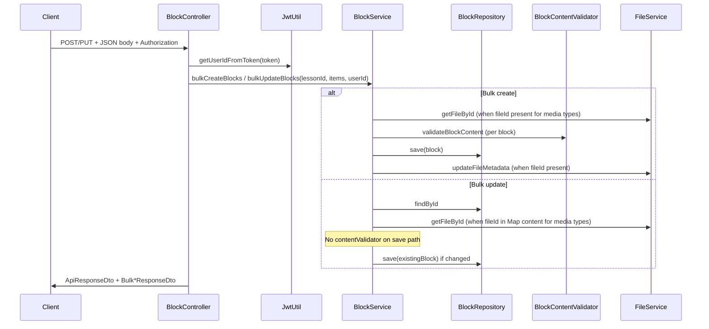

# BlockController: bulk create and bulk update flow

This document describes how **bulk block creation** and **bulk block updates** flow from `BlockController` through `BlockService`, including request/response shapes and important behavioral details. Implementation lives in the **`course-forge-backend`** module (paths below are relative to the repository root).

---

## Endpoints

| Operation | HTTP | Path | Controller method |
|-----------|------|------|-------------------|
| Bulk create | `POST` | `/blocks/{lessonId}/bulk` | `bulkCreateBlocks` |
| Bulk update | `PUT` | `/blocks/{lessonId}/bulk-update` | `bulkUpdateBlocks` |

Both endpoints expect a JSON body and an `Authorization` header whose token is parsed as `Bearer <token>` (same pattern as other authenticated block operations in this controller).

---

## High-level sequence



---

## Bulk create (`POST /blocks/{lessonId}/bulk`)

### Controller responsibilities

1. Read `Authorization`, extract JWT, resolve `userId` via `JwtUtil`.
2. Accept `@Valid` `BulkBlockCreateRequestDto` in the request body.
3. Delegate to `blockService.bulkCreateBlocks(lessonId, request.getBlocks(), userId)`.
4. Map each persisted `Block` to `BlockResponseDto` via `BlockMapper`.
5. Build `BulkBlockCreateResponseDto` with `createdBlocks` and `totalCreated` (size of created list).
6. Return `200 OK` with `ApiResponseDto.success(...)`.

Relevant controller code:

```389:426:d:\ABHI\OFFICE\Mundrisoft\Content Creator\course-forge-backend\src\main\java\com\mundrisoft\courseforge\controller\BlockController.java
    // ========== BULK CREATE BLOCKS ==========
    @PostMapping("/{lessonId}/bulk")
    ...
    public ResponseEntity<ApiResponseDto<BulkBlockCreateResponseDto>> bulkCreateBlocks(
            @PathVariable String lessonId,
            @Valid @RequestBody BulkBlockCreateRequestDto request,
            HttpServletRequest httpRequest) {
        
        String authHeader = httpRequest.getHeader("Authorization");
        String token = authHeader.substring(7);
        String userId = jwtUtil.getUserIdFromToken(token);
        
        List<Block> createdBlocks = blockService.bulkCreateBlocks(lessonId, request.getBlocks(), userId);
        ...
        return ResponseEntity.ok(ApiResponseDto.success(response, "Blocks created successfully"));
    }
```

### Request DTOs

- **`BulkBlockCreateRequestDto`**: wrapper with a single required non-empty list, `blocks`, each element validated with `@Valid`.
- **`BlockCreateItemDto`** (each list element):
  - `type` — required string (must match `Block.BlockType` enum name when saved).
  - `content` — required `Object` (typically `Map` for most blocks, or `List` for structures such as `QUIZ`).
  - `orderIndex` — required `Integer`.
  - `fileId` — optional; can also appear inside `content` as `fileId` when `content` is a `Map`.

### Service layer (`BlockService.bulkCreateBlocks`)

Runs inside `@Transactional`.

For **each** `BlockCreateItemDto`:

1. **Resolve `fileId`**: use `item.getFileId()`, or if null and `content` is a `Map`, read `content.fileId`.
2. **Media types**: For types that “require” a file (see list below), a blank `fileId` is treated as `null` (creation still proceeds).
3. **Existence check**: If the block type requires a file **and** `fileId` is non-blank, `validateFileExists` loads metadata via `FileService`; missing file → `IllegalArgumentException`.
4. **Serialized content**: `createContentWithFileId` builds JSON:
   - For `Map` content: ensures `fileId` key is set when a non-blank `fileId` exists; for file-requiring types with no `fileId`, sets `fileId` to `null` in the map.
   - For `List` content (e.g. quiz payload): `fileId` on the item is ignored with a warning log.
5. **Entity build**: `lessonId` from path; `type` from item; `content` as JSON string; `fileId` column set; `orderIndex`; **`status` fixed to `ACTIVE`**; `createdBy` / `updatedBy` set to `userId`.
6. **Validation**: `contentValidator.validateBlockContent(block)` before save.
7. **Persist**: `blockRepository.save(block)`.
8. **File linkage**: If `fileId` is non-blank, `updateFileMetadataWithBlock` sets file metadata `entityId` to `lessonId`, `entityType` to block type string, `context` to `"BLOCK_MEDIA"`.

Types treated as file-oriented in bulk create/update (`requiresFile`):

- `IMAGE`, `VIDEO`
- Image layouts: `TWO_COLUMN_IMAGE`, `THREE_COLUMN_IMAGE`, `IMAGE_TEXT_BOTTOM`, `TEXT_IMAGE_BOTTOM`, `IMAGE_TEXT_RIGHT`, `TEXT_IMAGE_LEFT`
- Video layouts: `TWO_COLUMN_VIDEO`, `THREE_COLUMN_VIDEO`, `VIDEO_TEXT_BOTTOM`, `TEXT_VIDEO_BOTTOM`, `VIDEO_TEXT_RIGHT`, `TEXT_VIDEO_LEFT`

### Response

- **`BulkBlockCreateResponseDto`**: `createdBlocks` (`List<BlockResponseDto>`), `totalCreated` (int).

---

## Bulk update (`PUT /blocks/{lessonId}/bulk-update`)

### Controller responsibilities

Same auth and mapping pattern as bulk create, but calls `blockService.bulkUpdateBlocks(lessonId, request.getBlocks(), userId)` and returns `BulkBlockUpdateResponseDto` with `updatedBlocks` and `totalUpdated`.

```429:462:d:\ABHI\OFFICE\Mundrisoft\Content Creator\course-forge-backend\src\main\java\com\mundrisoft\courseforge\controller\BlockController.java
    // ========== BULK UPDATE BLOCKS ==========
    @PutMapping("/{lessonId}/bulk-update")
    ...
    public ResponseEntity<ApiResponseDto<BulkBlockUpdateResponseDto>> bulkUpdateBlocks(
            @PathVariable String lessonId,
            @Valid @RequestBody BulkBlockUpdateRequestDto request,
            HttpServletRequest httpRequest) {
        ...
        List<Block> updatedBlocks = blockService.bulkUpdateBlocks(lessonId, request.getBlocks(), userId);
        ...
        return ResponseEntity.ok(ApiResponseDto.success(response, "Blocks updated successfully"));
    }
```

### Request DTOs

- **`BulkBlockUpdateRequestDto`**: non-empty `blocks` list with `@Valid` children.
- **`BulkBlockUpdateItemDto`**:
  - `id` — required (target block).
  - `content` — optional `Object` (`Map` or `List`). Omitted or “empty” `Map`/`List` means no content change.
  - `orderIndex` — optional; if present, replaces block order.

**Note:** Bulk update does **not** accept a `status` field on items; status is unchanged by this endpoint.

### Service layer (`BlockService.bulkUpdateBlocks`)

Runs inside `@Transactional`.

For **each** `BulkBlockUpdateItemDto`:

1. **Load block** by `item.getId()`; if missing → `IllegalArgumentException`.
2. **Lesson guard**: `existingBlock.getLessonId()` must equal path `lessonId`, or `IllegalArgumentException`.
3. **Optional file validation** (when `content` is a `Map`):
   - For file-requiring block types, blank `fileId` in the map is normalized to `null`.
   - If after normalization `fileId` is non-blank, `validateFileExists` runs.
4. **Content patch** (only if `content` is non-null and not an empty `Map`/`List`):
   - `createContentFromUpdateItem` serializes to JSON string.
   - For `Map`: normalizes empty `fileId` to `null`; non-empty `fileId` is kept (comment in code notes `fileUrl` is expected to be resolved elsewhere when needed).
   - For `List`: if block type is `FLASH_CARDS`, sorts list elements by `orderIndex`; if `TAB`, sorts by `orderIndex` similarly.
   - Sets `existingBlock.setContent(newContent)` and marks the row as updated.
5. **Order**: If `item.getOrderIndex() != null`, sets `orderIndex` and marks updated.
6. **Persist only if changed**: If neither content nor order changed, the block is **not** saved and **not** included in the returned list (logged as “No changes provided”).
7. **If changed**: `setUpdatedBy(userId)`, `blockRepository.save(existingBlock)`, append to result list.

**Important differences from bulk create:**

- **No `BlockContentValidator.validateBlockContent`** on this path (bulk create does validate). Updates use direct `save` without going through `updateBlock()`, which is where validation runs for single-block updates elsewhere in the service.
- **No `updateFileMetadataWithBlock`** when `fileId` changes in content; only existence is optionally checked when a non-blank `fileId` is supplied in a `Map`.

### Response

- **`BulkBlockUpdateResponseDto`**: `updatedBlocks` (only blocks that were actually saved), `totalUpdated` (that list’s size — can be smaller than the number of items in the request if some items were no-ops).

---

## Comparison summary

| Aspect | Bulk create | Bulk update |
|--------|-------------|-------------|
| Lesson scope | `lessonId` from path only (not repeated per item) | Path `lessonId` must match each block’s `lessonId` |
| Block identity | New UUID per save | Requires existing `id` |
| Default status | Always `ACTIVE` | Unchanged |
| Content validation | `validateBlockContent` before save | Not invoked on save path |
| File metadata after save | Updated when `fileId` present | Not updated by this flow |
| Partial / no-op items | N/A (always creates) | Items with no effective change omitted from response |

---

## Related code references

- Controller: `course-forge-backend/src/main/java/com/mundrisoft/courseforge/controller/BlockController.java`
- Service: `course-forge-backend/src/main/java/com/mundrisoft/courseforge/service/BlockService.java` (`bulkCreateBlocks`, `bulkUpdateBlocks`, `createContentWithFileId`, `createContentFromUpdateItem`)
- DTOs: `BulkBlockCreateRequestDto`, `BlockCreateItemDto`, `BulkBlockUpdateRequestDto`, `BulkBlockUpdateItemDto`, `BulkBlockCreateResponseDto`, `BulkBlockUpdateResponseDto`
- Entity: `course-forge-backend/src/main/java/com/mundrisoft/courseforge/entity/Block.java` (`content` JSON column, `fileId`, `orderIndex`, `status`)

---

## Client integration notes

1. **Uploads**: Bulk APIs reference media by **`fileId`** (pre-uploaded file metadata), not multipart files. Typical flow: upload file(s), then bulk create/update with those IDs in `content` and/or `fileId` on create items.
2. **Ordering**: Create requires explicit `orderIndex` per item. Update can send `orderIndex` only, content only, or both.
3. **Idempotency / errors**: Create validates each block before insert; a failure mid-transaction rolls back the whole bulk (transactional). Same for bulk update.
4. **Response size**: `totalUpdated` reflects only persisted changes; compare with request list length when auditing.
