# EMBED Block End-to-End Plan (Editor + API)

## Scope And Principles
- **Scope locked to v1:** backend + frontend editor flow only (no SCORM import/export in this release).
- **Resolution strategy:** backend-managed provider resolver with **oEmbed + allowlist** (recommended default without third-party Embedly dependency).
- **Compatibility rule:** additive/non-breaking changes only; existing block APIs and response shapes remain stable.

## Target Architecture

```mermaid
flowchart LR
  UserInput[UserPastesURLOrIframe] --> FEValidate[FrontendLightValidation]
  FEValidate --> ResolveCall[POST_EmbedResolve]
  ResolveCall --> BEParse[BackendParseAndNormalize]
  BEParse --> HostPolicy[AllowlistAndSecurityChecks]
  HostPolicy --> Resolver[ProviderResolver_oEmbed]
  Resolver --> Canonical[CanonicalEmbedPayload]
  Canonical --> FEPreview[FrontendPreviewAndEdit]
  FEPreview --> SaveBlock[ExistingBlockCreateOrUpdateAPI]
  SaveBlock --> BlockValidator[BlockContentValidator_EMBED]
  BlockValidator --> DBPersist[BlocksTable_type_EMBED_contentJSON]
```

## Phase 1: Backend Domain + Storage Readiness
- Add new enum type `EMBED` in entity and DB enum migration.
- Files:
  - [d:/ABHI/OFFICE/Mundrisoft/Content Creator/course-forge-backend/src/main/java/com/mundrisoft/courseforge/entity/Block.java](d:/ABHI/OFFICE/Mundrisoft/Content%20Creator/course-forge-backend/src/main/java/com/mundrisoft/courseforge/entity/Block.java)
  - New migration beside [d:/ABHI/OFFICE/Mundrisoft/Content Creator/course-forge-backend/src/main/resources/db/migration/dev/abhi/block-editor-improvements/V66__Add_attachment_block_type.sql](d:/ABHI/OFFICE/Mundrisoft/Content%20Creator/course-forge-backend/src/main/resources/db/migration/dev/abhi/block-editor-improvements/V66__Add_attachment_block_type.sql)
- Keep migration additive and aligned with current enum ordering style used in recent scripts.

## Phase 2: Canonical EMBED Contract
- Define a canonical `content` shape for one embed block:
  - `input` (original pasted value, optional audit)
  - `originalUrl` (required)
  - `embedUrl` (required for iframe rendering)
  - `title`, `description`, `thumbnail`, `provider`, `providerUrl`, `favicon`, `embedType` (optional metadata)
  - `showMetaData` (optional, default true)
  - `resolvedBy` (`OEMBED` | `RAW_IFRAME`), `resolvedAt` (optional)
- Update defaults and docs generators:
  - [d:/ABHI/OFFICE/Mundrisoft/Content Creator/course-forge-backend/src/main/java/com/mundrisoft/courseforge/service/BlockContentFactory.java](d:/ABHI/OFFICE/Mundrisoft/Content%20Creator/course-forge-backend/src/main/java/com/mundrisoft/courseforge/service/BlockContentFactory.java)
  - [d:/ABHI/OFFICE/Mundrisoft/Content Creator/course-forge-backend/src/main/java/com/mundrisoft/courseforge/controller/BlockController.java](d:/ABHI/OFFICE/Mundrisoft/Content%20Creator/course-forge-backend/src/main/java/com/mundrisoft/courseforge/controller/BlockController.java)
  - [d:/ABHI/OFFICE/Mundrisoft/Content Creator/course-forge-backend/src/main/java/com/mundrisoft/courseforge/util/BlockSchemaUtil.java](d:/ABHI/OFFICE/Mundrisoft/Content%20Creator/course-forge-backend/src/main/java/com/mundrisoft/courseforge/util/BlockSchemaUtil.java)

## Phase 3: Validation + Security Rules
- Extend block validators for `EMBED` content validation:
  - Required fields for persisted block (`originalUrl`, `embedUrl`).
  - URL safety checks: scheme whitelist (`https`), host normalization, block private/internal targets, reject non-web schemes.
  - If iframe input is used: enforce Rise-like syntax constraints (single iframe, proper closing tag, no stray text outside/inside).
- Files:
  - [d:/ABHI/OFFICE/Mundrisoft/Content Creator/course-forge-backend/src/main/java/com/mundrisoft/courseforge/service/BlockContentValidator.java](d:/ABHI/OFFICE/Mundrisoft/Content%20Creator/course-forge-backend/src/main/java/com/mundrisoft/courseforge/service/BlockContentValidator.java)
  - [d:/ABHI/OFFICE/Mundrisoft/Content Creator/course-forge-backend/src/main/java/com/mundrisoft/courseforge/service/TemplateBlockContentValidator.java](d:/ABHI/OFFICE/Mundrisoft/Content%20Creator/course-forge-backend/src/main/java/com/mundrisoft/courseforge/service/TemplateBlockContentValidator.java)

## Phase 4: New Resolver API (Non-Breaking Addition)
- Add a new endpoint (additive): `POST /api/blocks/embed/resolve`.
- Request DTO: `{ input: string }` where `input` is URL or iframe snippet.
- Response DTO: normalized canonical embed payload + status fields (`resolved`, `reason` when unsupported).
- Backend flow:
  - Parse input -> extract candidate URL (`src` from iframe or URL itself).
  - Apply allowlist policy (configured in properties).
  - Route to provider resolver (Vimeo/YouTube first) using oEmbed.
  - Fallback policy for supported but non-oEmbed providers: `RAW_IFRAME` with minimal metadata.
- Files to add/update:
  - [d:/ABHI/OFFICE/Mundrisoft/Content Creator/course-forge-backend/src/main/java/com/mundrisoft/courseforge/controller/BlockController.java](d:/ABHI/OFFICE/Mundrisoft/Content%20Creator/course-forge-backend/src/main/java/com/mundrisoft/courseforge/controller/BlockController.java)
  - New DTOs under `.../dto/` (request/response)
  - New service `EmbedResolutionService` under `.../service/`
  - Config in [d:/ABHI/OFFICE/Mundrisoft/Content Creator/course-forge-backend/src/main/resources/application.properties](d:/ABHI/OFFICE/Mundrisoft/Content%20Creator/course-forge-backend/src/main/resources/application.properties)
- Respect workspace rule for new endpoints: `ResponseEntity<ApiResponseDto<T>>`, typed exceptions, bean validation.

## Phase 5: Frontend Editor Integration
- Add `embed` block type and editor registration.
- Embed editor UX:
  - One input supporting URL or iframe.
  - “Resolve” action calling new backend endpoint.
  - Preview area (iframe + metadata), editable metadata fields if product wants overrides.
  - Persist canonical `content` via existing block save flow.
- Files:
  - [d:/ABHI/OFFICE/Mundrisoft/Content Creator/course-forge-frontend/src/types/course.ts](d:/ABHI/OFFICE/Mundrisoft/Content%20Creator/course-forge-frontend/src/types/course.ts)
  - [d:/ABHI/OFFICE/Mundrisoft/Content Creator/course-forge-frontend/src/components/blocks/editor/registry.ts](d:/ABHI/OFFICE/Mundrisoft/Content%20Creator/course-forge-frontend/src/components/blocks/editor/registry.ts)
  - [d:/ABHI/OFFICE/Mundrisoft/Content Creator/course-forge-frontend/src/components/blocks/addBlockMenu.tsx](d:/ABHI/OFFICE/Mundrisoft/Content%20Creator/course-forge-frontend/src/components/blocks/addBlockMenu.tsx)
  - New `EmbedEditor` component under `.../components/blocks/editor/embed/`

## Phase 6: Configuration + Provider Rollout
- Introduce config-driven allowlist and resolver toggles:
  - `embed.allowed-hosts`
  - `embed.oembed.providers` (map/patterns)
  - timeouts / max response size
- Start with a small approved list (e.g., Vimeo + YouTube), expand without code rewrite.

## Phase 7: Test Strategy
- Backend unit tests:
  - Input parser tests: URL/iframe valid/invalid cases (Rise-like constraints).
  - Validation tests for `EMBED` content required fields and safety checks.
  - Resolver mapping tests for provider responses to canonical payload.
- Backend integration tests:
  - Resolve endpoint success/failure contracts.
  - Block create/update with `EMBED` content path.
- Frontend tests:
  - Embed editor resolve flow, error messaging, and persisted payload.
- Regression:
  - Ensure existing block types and block endpoints unchanged.

## Phase 8: Delivery + Rollout Checklist
- Add short product/dev doc: accepted formats, supported providers, known limitation (“some sites block iframe embedding”).
- QA checklist:
  - URL paste and iframe paste both work.
  - Unsupported host gives deterministic error.
  - Saved EMBED reopens and renders correctly.
- Release as additive feature, no changes to existing clients required.

## Suggested Milestones
- **M1:** DB + enum + validator/factory/doc updates.
- **M2:** `/embed/resolve` endpoint + provider resolver + tests.
- **M3:** frontend embed editor + save/preview flow.
- **M4:** hardening (timeouts, logs, docs, QA pass).

## End Deliverables Summary
- **Endpoints We Will Develop**
  - `POST /api/blocks/embed/resolve`
    - Purpose: accept URL or iframe input and return normalized EMBED payload.
    - Request: `{ "input": "https://... or <iframe ...></iframe>" }`
    - Response: canonical fields like `originalUrl`, `embedUrl`, `title`, `provider`, `thumbnail`, `embedType`, `resolved`, `reason`.
  - Existing block create/update endpoints (no contract break)
    - Purpose: persist `type=EMBED` with validated `content` JSON.
    - Usage: frontend saves EMBED through current lesson/block save flow.

- **How Endpoint Usage Works In Product Flow**
  - User pastes URL/iframe in editor.
  - Frontend calls `POST /api/blocks/embed/resolve` for normalization and metadata enrichment.
  - Frontend shows preview/metadata and stores resolved payload in block state.
  - On Save, frontend sends existing block create/update API payload with `type=EMBED`.
  - Backend validates and persists to `blocks.content`.

- **UI Integration We Will Build**
  - Add new `embed` block option in Add Block menu.
  - Add `EmbedEditor` in block registry and editor canvas.
  - Input supports both URL and iframe paste.
  - Resolve action with loading/error states.
  - Preview panel (iframe + metadata toggle) and persisted re-open behavior.
