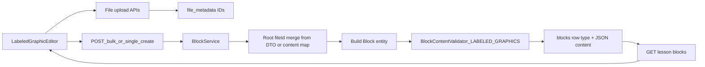

# Labeled Graphic Block End-to-End Plan (API + persistence)

## Scope and principles

- **Goal:** The web app already authors **Labeled Graphic** blocks (`labeled-graphics` in UI, `LABELED_GRAPHICS` on the wire in `LessonEditor`). Backend must **accept, validate, store, and return** that shape through the **existing** block APIs—no new public JSON contract for other block types.
- **v1 scope:** Persistence + validation + file reference rules only (no SCORM import/export in this ticket unless separately scoped).
- **Compatibility:** Additive only: new enum value, new validator branch, optional `BlockService` tweaks. **Do not** change response shapes or status codes for existing endpoints.

## Target architecture



## Phase 1: Backend domain + storage readiness

- Add **`LABELED_GRAPHICS`** to `Block.BlockType` in:
  - [d:/ABHI/OFFICE/Mundrisoft/Content Creator/course-forge-backend/src/main/java/com/mundrisoft/courseforge/entity/Block.java](d:/ABHI/OFFICE/Mundrisoft/Content%20Creator/course-forge-backend/src/main/java/com/mundrisoft/courseforge/entity/Block.java)
- Add **additive** Flyway/Liquibase migration extending MySQL `blocks.type` ENUM (match ordering/style of prior scripts such as `V41__Add_tab_block_type.sql`). Use the next free version in [d:/ABHI/OFFICE/Mundrisoft/Content Creator/course-forge-backend/src/main/resources/db/migration](d:/ABHI/OFFICE/Mundrisoft/Content%20Creator/course-forge-backend/src/main/resources/db/migration) (e.g. `V56__Add_labeled_graphics_block_type.sql` if that number is unused in your branch).
- **Failure mode until done:** `Block.BlockType.valueOf("LABELED_GRAPHICS")` in bulk create throws; DB rejects inserts if ENUM lacks the value.

## Phase 2: Canonical `LABELED_GRAPHICS` content contract

Persist **`blocks.content`** as a **single JSON object** (not an array):

| Field | Type | Notes |
| ----- | ---- | ----- |
| `image` | object | `fileId` (UUID string), `altText` (string). Background image. |
| `markers` | array | Each marker: stable `id`, `x` / `y` (0–100), `title`, HTML `description`, `style`, optional `media` (`type`, `fileId`, `altText`) per frontend. |

**Example (illustrative):**

```json
{
  "image": { "altText": "Diagram", "fileId": "uuid-of-file_metadata" },
  "markers": [
    {
      "id": "marker-1",
      "x": 51,
      "y": 34,
      "style": "plus",
      "title": "Region A",
      "description": "<p>Details</p>",
      "media": null
    }
  ]
}
```

- Align defaults / AI schema docs if this type is listed for generation:
  - [d:/ABHI/OFFICE/Mundrisoft/Content Creator/course-forge-backend/src/main/java/com/mundrisoft/courseforge/service/BlockContentFactory.java](d:/ABHI/OFFICE/Mundrisoft/Content%20Creator/course-forge-backend/src/main/java/com/mundrisoft/courseforge/service/BlockContentFactory.java)
  - [d:/ABHI/OFFICE/Mundrisoft/Content Creator/course-forge-backend/src/main/java/com/mundrisoft/courseforge/util/BlockSchemaUtil.java](d:/ABHI/OFFICE/Mundrisoft/Content%20Creator/course-forge-backend/src/main/java/com/mundrisoft/courseforge/util/BlockSchemaUtil.java)

**Frontend mapping (non-normative):** UI type `labeled-graphics` ↔ API `LABELED_GRAPHICS` in `LessonEditor.tsx`.

## Phase 3: Validation rules

- Extend [d:/ABHI/OFFICE/Mundrisoft/Content Creator/course-forge-backend/src/main/java/com/mundrisoft/courseforge/service/BlockContentValidator.java](d:/ABHI/OFFICE/Mundrisoft/Content%20Creator/course-forge-backend/src/main/java/com/mundrisoft/courseforge/service/BlockContentValidator.java) with a **`LABELED_GRAPHICS`** branch:
  - `content` parses as JSON **object** with required keys `image`, `markers`.
  - `markers` is array; each item has required fields per product (minimum: `id`, numeric `x`/`y` in **0–100**).
  - Optional: enforce `image.fileId` present before publish vs allow draft empty image (product decision).
  - Validate **nested** `fileId` values exist (lesson/workspace scope) where the codebase already does this for other types—reuse `FileService` patterns.
- Update [d:/ABHI/OFFICE/Mundrisoft/Content Creator/course-forge-backend/src/main/java/com/mundrisoft/courseforge/service/TemplateBlockContentValidator.java](d:/ABHI/OFFICE/Mundrisoft/Content%20Creator/course-forge-backend/src/main/java/com/mundrisoft/courseforge/service/TemplateBlockContentValidator.java) if template flows validate block JSON by type.

## Phase 4: BlockService + `blocks.file_id` behavior

- Today **`requiresFile`** does **not** include `LABELED_GRAPHICS` ([d:/ABHI/OFFICE/Mundrisoft/Content Creator/course-forge-backend/src/main/java/com/mundrisoft/courseforge/service/BlockService.java](d:/ABHI/OFFICE/Mundrisoft/Content%20Creator/course-forge-backend/src/main/java/com/mundrisoft/courseforge/service/BlockService.java)): root `fileId` is optional; background lives under **`content.image.fileId`**.
- **Decide explicitly:**
  - Whether clients should send **top-level** `BlockCreateItemDto.fileId` (or `content.fileId`) for the **background** so `updateFileMetadataWithBlock` runs for the primary asset, **or**
  - Whether to extend service logic to promote `content.image.fileId` to `blocks.file_id` / metadata linkage for analytics—**only** if product agrees (avoid silent behavior change for other types).
- Document the chosen rule in code comments next to `bulkCreateBlocks` / `createContentWithFileId` for this type.

## Phase 5: REST surface (no new endpoints required for v1)

Existing routes (context path `/api`):

| Method | Path | Role for `LABELED_GRAPHICS` |
| ------ | ---- | --------------------------- |
| `POST` | `/api/blocks/{lessonId}/bulk` | Primary editor path; `BlockCreateItemDto.type` = `LABELED_GRAPHICS`, `content` = object. |
| `PUT` | `/api/blocks/{lessonId}/bulk-update` | Partial updates; `BulkBlockUpdateItemDto` with `content` object. |
| `POST` | `/api/blocks` | Multipart single create. |
| `PUT` | `/api/blocks/{id}` | Multipart single update. |
| `GET` | `/api/blocks/lesson/{lessonId}` | List; `content` returned as JSON string in `BlockResponseDto`. |
| `GET` | `/api/files/{fileId}` | Binary for images referenced in `content`. |

**Code anchors:** [d:/ABHI/OFFICE/Mundrisoft/Content Creator/course-forge-backend/src/main/java/com/mundrisoft/courseforge/controller/BlockController.java](d:/ABHI/OFFICE/Mundrisoft/Content%20Creator/course-forge-backend/src/main/java/com/mundrisoft/courseforge/controller/BlockController.java), DTOs under `.../dto/`, `BlockMapper`.

**No dedicated “resolve” API** (unlike EMBED): labeled graphic content is author-built JSON plus uploaded file IDs.

## Phase 6: Test strategy

- **Unit:** `BlockContentValidator`—valid minimal payload, missing `image`, bad `x`/`y`, unknown `fileId`, oversized markers list (if cap added).
- **Integration:** Bulk create → `GET` lesson blocks → bulk update marker position → assert JSON round-trip.
- **Regression:** Other block types’ bulk create/update unchanged.

## Phase 7: Delivery + QA checklist

- QA: create block in UI, reload lesson, verify markers and image URLs; API-only create with curl/Postman using a real `lessonId` and file IDs.
- Confirm DB ENUM and JPA enum stay in sync across environments.

## Suggested milestones

- **M1:** Enum + migration + smoke insert.
- **M2:** Validator + file existence rules + unit tests.
- **M3:** File-metadata / `blocks.file_id` policy implemented and documented + integration tests.
- **M4:** Schema util / factory alignment (if needed) + QA sign-off.

## End deliverables summary

- **Endpoints used (unchanged contract):** existing block CRUD and bulk APIs; **`type`** value **`LABELED_GRAPHICS`** with validated object **`content`**.
- **How usage fits the product flow:** editor uploads images → receives `fileId`s → saves lesson via bulk API with `LABELED_GRAPHICS` and nested JSON → learner/runtime reads same JSON + `GET /api/files/{fileId}` for bitmaps.
