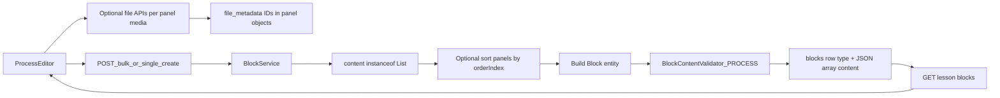

# Process Block End-to-End Plan (API + persistence)

## Scope and principles

- **Goal:** The web app already authors **Process** blocks (`process` in UI, `PROCESS` on the wire in `LessonEditor`). Backend must **accept, validate, store, and return** that shape through the **existing** block APIs.
- **Content shape:** `blocks.content` is a **JSON array** of panel objects (not a single object). This differs from `LABELED_GRAPHICS` and most layout blocks—`BlockService` list branches must treat `PROCESS` explicitly where ordering matters.
- **v1 scope:** Persistence + validation + optional `orderIndex` normalization on save (no branching logic, no embeds inside panels unless product expands scope later).
- **Compatibility:** Additive only. **Do not** change response shapes or status codes for existing endpoints.

## Target architecture



## Phase 1: Backend domain + storage readiness

- Add **`PROCESS`** to `Block.BlockType` in:
  - [d:/ABHI/OFFICE/Mundrisoft/Content Creator/course-forge-backend/src/main/java/com/mundrisoft/courseforge/entity/Block.java](d:/ABHI/OFFICE/Mundrisoft/Content%20Creator/course-forge-backend/src/main/java/com/mundrisoft/courseforge/entity/Block.java)
- Add **additive** migration extending MySQL `blocks.type` ENUM under [d:/ABHI/OFFICE/Mundrisoft/Content Creator/course-forge-backend/src/main/resources/db/migration](d:/ABHI/OFFICE/Mundrisoft/Content%20Creator/course-forge-backend/src/main/resources/db/migration), matching the style of `V41__Add_tab_block_type.sql`. If multiple new block types ship together, prefer **one** `ALTER TABLE ... MODIFY COLUMN type ENUM(...)` that appends all new values to avoid conflicting migrations.
- **Failure mode until done:** `Block.BlockType.valueOf("PROCESS")` in bulk create throws; DB rejects rows when ENUM omits `PROCESS`.

## Phase 2: Canonical `PROCESS` content contract

Persist **`blocks.content`** as a **JSON array** ordered by authoring intent (typically **intro** → **step** × N → **summary**). Each element is an object:

| Field | Type | Notes |
| ----- | ---- | ----- |
| `id` | string | Stable id (e.g. `intro`, `summary`, UUID for steps). |
| `type` | string | `intro` \| `step` \| `summary`. |
| `title` | string | Required for visible panels (see validation). |
| `description` | string | HTML; required for visible steps; intro/summary when not hidden. |
| `isHidden` | boolean | When true, intro/summary may omit visible copy per product rules. |
| `orderIndex` | number | 1-based ordering in editor; server may normalize sort on save. |
| `media` | object or null | Optional future / current image or video attachment (`fileId`, etc.) per panel. |

**Example (illustrative):**

```json
[
  { "id": "intro", "type": "intro", "title": "Introduction", "description": "<p>...</p>", "isHidden": false, "orderIndex": 1, "media": null },
  { "id": "step-uuid", "type": "step", "title": "Step 1", "description": "<p>...</p>", "isHidden": false, "orderIndex": 2, "media": null },
  { "id": "summary", "type": "summary", "title": "Summary", "description": "<p>...</p>", "isHidden": false, "orderIndex": 3, "media": null }
]
```

- Update [d:/ABHI/OFFICE/Mundrisoft/Content Creator/course-forge-backend/src/main/java/com/mundrisoft/courseforge/service/BlockContentFactory.java](d:/ABHI/OFFICE/Mundrisoft/Content%20Creator/course-forge-backend/src/main/java/com/mundrisoft/courseforge/service/BlockContentFactory.java) if PROCESS needs the same **list + orderIndex** treatment as `FLASH_CARDS` / `TAB` / `ACCORDION` on create/update.
- Update [d:/ABHI/OFFICE/Mundrisoft/Content Creator/course-forge-backend/src/main/java/com/mundrisoft/courseforge/util/BlockSchemaUtil.java](d:/ABHI/OFFICE/Mundrisoft/Content%20Creator/course-forge-backend/src/main/java/com/mundrisoft/courseforge/util/BlockSchemaUtil.java) if AI or docs generation must know this type.

**Frontend mapping (non-normative):** UI type `process` ↔ API `PROCESS` in [d:/ABHI/OFFICE/Mundrisoft/Content Creator/course-forge-frontend/src/components/editor/LessonEditor.tsx](d:/ABHI/OFFICE/Mundrisoft/Content%20Creator/course-forge-frontend/src/components/editor/LessonEditor.tsx). Editor: [d:/ABHI/OFFICE/Mundrisoft/Content Creator/course-forge-frontend/src/components/blocks/editor/process/ProcessEditor.tsx](d:/ABHI/OFFICE/Mundrisoft/Content%20Creator/course-forge-frontend/src/components/blocks/editor/process/ProcessEditor.tsx). Client validation reference: [d:/ABHI/OFFICE/Mundrisoft/Content Creator/course-forge-frontend/src/components/blocks/blockSetting.tsx](d:/ABHI/OFFICE/Mundrisoft/Content%20Creator/course-forge-frontend/src/components/blocks/blockSetting.tsx) (`case "process"`).

## Phase 3: BlockService list handling

- **Bulk create:** [d:/ABHI/OFFICE/Mundrisoft/Content Creator/course-forge-backend/src/main/java/com/mundrisoft/courseforge/service/BlockService.java](d:/ABHI/OFFICE/Mundrisoft/Content%20Creator/course-forge-backend/src/main/java/com/mundrisoft/courseforge/service/BlockService.java) `createContentWithFileId` already serializes `List` content as JSON; root `fileId` on DTO is only merged for **Map** content—appropriate for PROCESS (primary assets live on panels). Optionally warn or ignore root `fileId` for PROCESS consistently with QUIZ list behavior.
- **Bulk update:** Extend `createContentFromUpdateItem` with `PROCESS` alongside `FLASH_CARDS` / `TAB`: **sort panel list by `orderIndex`** before `writeValueAsString`, or document that order is client-owned and skip sort if product prefers raw order.
- **`blocks.file_id`:** `PROCESS` is not in `requiresFile`; expect **`file_id` null** at block row level unless product later mirrors a “primary” panel asset—document decision.

## Phase 4: Validation rules

- Extend [d:/ABHI/OFFICE/Mundrisoft/Content Creator/course-forge-backend/src/main/java/com/mundrisoft/courseforge/service/BlockContentValidator.java](d:/ABHI/OFFICE/Mundrisoft/Content%20Creator/course-forge-backend/src/main/java/com/mundrisoft/courseforge/service/BlockContentValidator.java) with **`PROCESS`**:
  - Parsed content is a **non-empty JSON array**.
  - Exactly one logical **intro** and one **summary** (by `type`), and **at least one** `step` (align with `blockSetting.tsx`).
  - For **visible** intro/summary (`isHidden` false): require non-blank `title` and non-empty plain-text from `description` (mirror client rules or document relaxed server rules).
  - For **every** `step`: require `title` and `description` (steps are always shown in client validation).
  - Optional: max step count (UI may cap, e.g. 10—confirm with frontend).
  - If `media.fileId` appears on panels, validate existence via existing file patterns.
- Update [d:/ABHI/OFFICE/Mundrisoft/Content Creator/course-forge-backend/src/main/java/com/mundrisoft/courseforge/service/TemplateBlockContentValidator.java](d:/ABHI/OFFICE/Mundrisoft/Content%20Creator/course-forge-backend/src/main/java/com/mundrisoft/courseforge/service/TemplateBlockContentValidator.java) if templates persist PROCESS blocks.

## Phase 5: REST surface (no new endpoints required for v1)

Same routes as other lesson blocks (context path `/api`):

| Method | Path | Role for `PROCESS` |
| ------ | ---- | ------------------ |
| `POST` | `/api/blocks/{lessonId}/bulk` | `BlockCreateItemDto.type` = `PROCESS`, `content` = **array**. |
| `PUT` | `/api/blocks/{lessonId}/bulk-update` | Replace `content` when provided as non-empty list. |
| `POST` | `/api/blocks` | Multipart single create. |
| `PUT` | `/api/blocks/{id}` | Multipart single update. |
| `GET` | `/api/blocks/lesson/{lessonId}` | List; `content` is JSON **string** (deserialize to array client-side). |
| `GET` | `/api/files/{fileId}` | Optional assets referenced from panel `media`. |

**Code anchors:** [d:/ABHI/OFFICE/Mundrisoft/Content Creator/course-forge-backend/src/main/java/com/mundrisoft/courseforge/controller/BlockController.java](d:/ABHI/OFFICE/Mundrisoft/Content%20Creator/course-forge-backend/src/main/java/com/mundrisoft/courseforge/controller/BlockController.java), DTOs under `.../dto/`, `BlockMapper`.

## Phase 6: Test strategy

- **Unit:** Validator—missing steps, hidden intro with empty fields allowed vs rejected, duplicate `type`, invalid `orderIndex`, unknown nested `fileId`.
- **Integration:** Bulk create with three panels → GET → bulk update reorder → assert array order and field round-trip.
- **Regression:** Map-based block types and list types (`FLASH_CARDS`, `TAB`) unchanged.

## Phase 7: Delivery + QA checklist

- QA in UI: add Process block, edit intro/steps/summary, hide intro, save, reload lesson.
- API-only: POST bulk with valid `PROCESS` array; expect 200 and stable error body on invalid payload (match existing `ApiResponseDto` error style).

## Suggested milestones

- **M1:** Enum + DB ENUM + smoke bulk create.
- **M2:** Validator parity with client rules + unit tests.
- **M3:** `BlockService` / `BlockContentFactory` ordering for PROCESS + integration tests.
- **M4:** Schema util + QA sign-off.

## End deliverables summary

- **Endpoints used (unchanged contract):** existing block CRUD and bulk APIs; **`type`** = **`PROCESS`**, **`content`** = validated **JSON array** of panels.
- **Product flow:** author edits panels in `ProcessEditor` → save via bulk API → runtime / preview reads array and renders **ProcessPreview**-equivalent experience.
