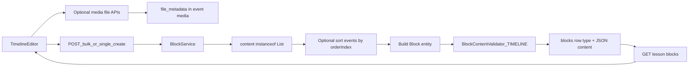

# Timeline Block End-to-End Plan (API + persistence)

## Scope and principles

- **Goal:** The web app already authors **Timeline** blocks (`timeline` in UI, `TIMELINE` on the wire in `LessonEditor`). Backend must **accept, validate, store, and return** compatible JSON through the **existing** block APIs.
- **Content shape:** Primary wire format from the editor is a **JSON array** of timeline events. The client also tolerates a **legacy object** `{ "items": [ ... ] }` when hydrating from API ([d:/ABHI/OFFICE/Mundrisoft/Content Creator/course-forge-frontend/src/components/editor/LessonEditor.tsx](d:/ABHI/OFFICE/Mundrisoft/Content%20Creator/course-forge-frontend/src/components/editor/LessonEditor.tsx)). Prefer persisting a **top-level array** for new writes; if legacy rows exist, either migrate them once or normalize in service layer before save.
- **v1 scope:** Persistence + validation + ordering (no new public endpoints). No SCORM scope unless ticket expands.
- **Compatibility:** Additive enum and validator only; stable `ApiResponseDto` and existing block routes.

## Target architecture



## Phase 1: Backend domain + storage readiness

- Add **`TIMELINE`** to `Block.BlockType` in:
  - [d:/ABHI/OFFICE/Mundrisoft/Content Creator/course-forge-backend/src/main/java/com/mundrisoft/courseforge/entity/Block.java](d:/ABHI/OFFICE/Mundrisoft/Content%20Creator/course-forge-backend/src/main/java/com/mundrisoft/courseforge/entity/Block.java)
- Add **additive** migration for `blocks.type` ENUM under [d:/ABHI/OFFICE/Mundrisoft/Content Creator/course-forge-backend/src/main/resources/db/migration](d:/ABHI/OFFICE/Mundrisoft/Content%20Creator/course-forge-backend/src/main/resources/db/migration), same style as `V41__Add_tab_block_type.sql`. Combine with other new block enum values in **one** `ALTER TABLE ... MODIFY COLUMN` when shipping multiple types to avoid migration ordering conflicts.
- **Failure mode until done:** `Block.BlockType.valueOf("TIMELINE")` throws on bulk create; DB rejects unknown `type`.

## Phase 2: Canonical `TIMELINE` content contract

**Canonical (recommended persisted form):** JSON **array** of event objects.

| Field | Type | Notes |
| ----- | ---- | ----- |
| `id` | string | Client-generated stable id per event. |
| `date` | string | Display date/label (required for publish per client validation). |
| `title` | string | Required when visible to learners. |
| `description` | string | HTML body; required non-empty plain text per client rules. |
| `orderIndex` | number | 1-based sequence; reindexed on drag in editor. |
| `media` | object or null | Optional `{ type, fileId?, url? }`; editor strips placeholder `fileId` on save when building API payload. |

**Example (illustrative):**

```json
[
  {
    "id": "item-abc123",
    "date": "Q1 2025",
    "title": "Kickoff",
    "description": "<p>We aligned on goals.</p>",
    "orderIndex": 1,
    "media": null
  }
]
```

**Legacy read shape:** `{ "items": [ ... ] }` — `LessonEditor` maps this to an array for UI. Backend validator may accept **either** on input and normalize to array before persist, or reject non-array with 4xx if you choose strict storage only (document the decision).

- [d:/ABHI/OFFICE/Mundrisoft/Content Creator/course-forge-backend/src/main/java/com/mundrisoft/courseforge/service/BlockContentFactory.java](d:/ABHI/OFFICE/Mundrisoft/Content%20Creator/course-forge-backend/src/main/java/com/mundrisoft/courseforge/service/BlockContentFactory.java): add `TIMELINE` list handling if you sort by `orderIndex` on create/update (same pattern as `ACCORDION` / `TAB`).
- [d:/ABHI/OFFICE/Mundrisoft/Content Creator/course-forge-backend/src/main/java/com/mundrisoft/courseforge/util/BlockSchemaUtil.java](d:/ABHI/OFFICE/Mundrisoft/Content%20Creator/course-forge-backend/src/main/java/com/mundrisoft/courseforge/util/BlockSchemaUtil.java): include TIMELINE if AI generation lists this type.

**Frontend references:** Editor [d:/ABHI/OFFICE/Mundrisoft/Content Creator/course-forge-frontend/src/components/blocks/editor/timeline/TimelineEditor.tsx](d:/ABHI/OFFICE/Mundrisoft/Content%20Creator/course-forge-frontend/src/components/blocks/editor/timeline/TimelineEditor.tsx); save mapping `timeline` → `TIMELINE` and `content` array in `LessonEditor.tsx`; validation [d:/ABHI/OFFICE/Mundrisoft/Content Creator/course-forge-frontend/src/components/blocks/blockSetting.tsx](d:/ABHI/OFFICE/Mundrisoft/Content%20Creator/course-forge-frontend/src/components/blocks/blockSetting.tsx) (`case "timeline"`).

## Phase 3: BlockService list handling

- [d:/ABHI/OFFICE/Mundrisoft/Content Creator/course-forge-backend/src/main/java/com/mundrisoft/courseforge/service/BlockService.java](d:/ABHI/OFFICE/Mundrisoft/Content%20Creator/course-forge-backend/src/main/java/com/mundrisoft/courseforge/service/BlockService.java):
  - **`createContentWithFileId`:** List path serializes as JSON; root DTO `fileId` is not merged into list content (same as `PROCESS` / multi-question `QUIZ`).
  - **`createContentFromUpdateItem`:** Add `TIMELINE` branch to **sort events by `orderIndex`** before persisting (align with `FLASH_CARDS`, `TAB`, planned `PROCESS`).
- **`blocks.file_id`:** Not required for timeline in current `requiresFile` set; optional panel `media.fileId` only—document expectation.

## Phase 4: Validation rules

- Extend [d:/ABHI/OFFICE/Mundrisoft/Content Creator/course-forge-backend/src/main/java/com/mundrisoft/courseforge/service/BlockContentValidator.java](d:/ABHI/OFFICE/Mundrisoft/Content%20Creator/course-forge-backend/src/main/java/com/mundrisoft/courseforge/service/BlockContentValidator.java) with **`TIMELINE`**:
  - Parsed content is a **non-empty array** of objects (after any `{ items }` normalization).
  - Each event: non-blank `date`, `title`, and `description` with non-empty plain text (mirror `blockSetting.tsx`).
  - Optional max event count if UI enforces one—keep server and client caps aligned.
  - Validate `media.fileId` when present using existing file-existence patterns.
- [d:/ABHI/OFFICE/Mundrisoft/Content Creator/course-forge-backend/src/main/java/com/mundrisoft/courseforge/service/TemplateBlockContentValidator.java](d:/ABHI/OFFICE/Mundrisoft/Content%20Creator/course-forge-backend/src/main/java/com/mundrisoft/courseforge/service/TemplateBlockContentValidator.java) if templates include timeline blocks.

## Phase 5: REST surface (no new endpoints for v1)

| Method | Path | Role for `TIMELINE` |
| ------ | ---- | -------------------- |
| `POST` | `/api/blocks/{lessonId}/bulk` | `type` = `TIMELINE`, `content` = **array** of events. |
| `PUT` | `/api/blocks/{lessonId}/bulk-update` | Replace `content` when non-empty list provided. |
| `POST` | `/api/blocks` | Multipart single create. |
| `PUT` | `/api/blocks/{id}` | Multipart single update. |
| `GET` | `/api/blocks/lesson/{lessonId}` | `content` as JSON string (array or legacy object—client normalizes). |
| `GET` | `/api/files/{fileId}` | Media assets for events. |

**Code anchors:** [d:/ABHI/OFFICE/Mundrisoft/Content Creator/course-forge-backend/src/main/java/com/mundrisoft/courseforge/controller/BlockController.java](d:/ABHI/OFFICE/Mundrisoft/Content%20Creator/course-forge-backend/src/main/java/com/mundrisoft/courseforge/controller/BlockController.java), DTOs under `.../dto/`, `BlockMapper`.

## Phase 6: Test strategy

- **Unit:** Validator—empty list, missing `date`/`title`/empty HTML description, invalid `media.fileId`, optional legacy `{ items }` normalization.
- **Integration:** Bulk create with two events → GET → bulk update reorder → assert order and fields.
- **Regression:** Other list-based block types unchanged.

## Phase 7: Delivery + QA checklist

- UI: add events, reorder, attach optional media, save, reload lesson.
- API: bulk payload matches `LessonEditor` outbound shape (`type: "TIMELINE"`, `content` array).

## Suggested milestones

- **M1:** Enum + DB ENUM + smoke bulk create.
- **M2:** Validator + unit tests (include legacy shape if supported).
- **M3:** `BlockService` / factory ordering + integration tests.
- **M4:** Schema util + QA sign-off.

## End deliverables summary

- **Endpoints:** Existing block CRUD and bulk only; **`type`** = **`TIMELINE`**, **`content`** = validated **JSON array** of events (canonical).
- **Product flow:** `TimelineEditor` builds ordered events → `LessonEditor` sends `TIMELINE` + array → learner/runtime consumes same structure (preview: [d:/ABHI/OFFICE/Mundrisoft/Content Creator/course-forge-frontend/src/components/blocks/preview/timeline/TimelinePreview.tsx](d:/ABHI/OFFICE/Mundrisoft/Content%20Creator/course-forge-frontend/src/components/blocks/preview/timeline/TimelinePreview.tsx)).
