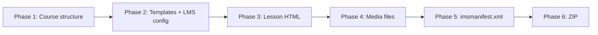
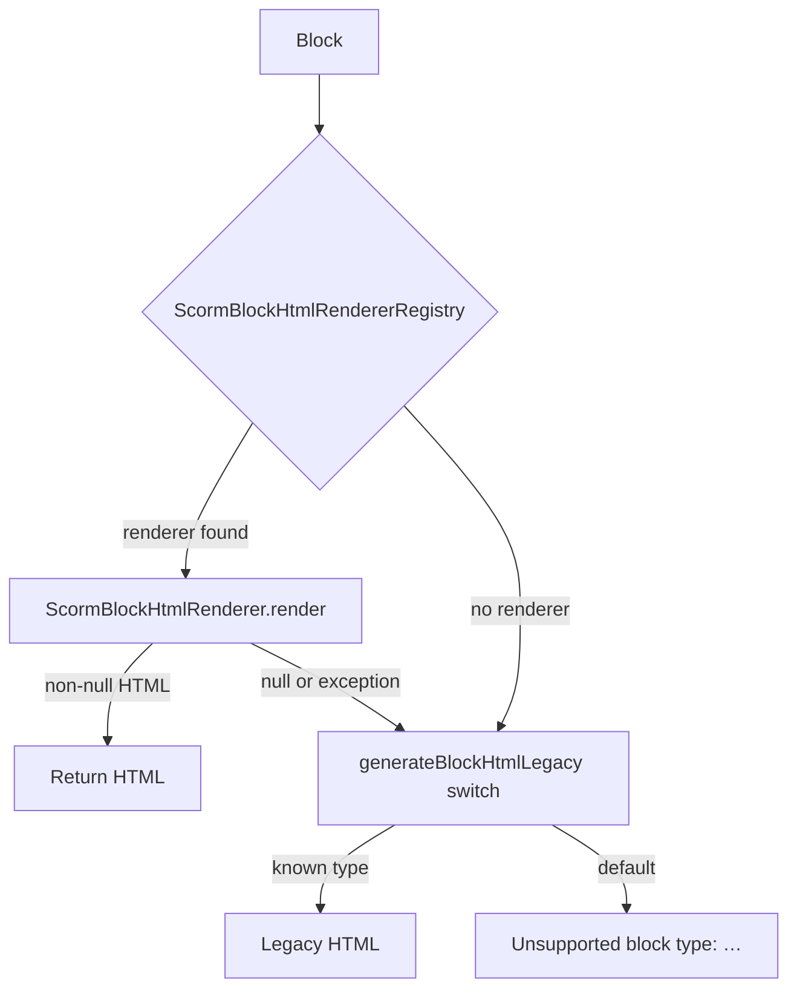
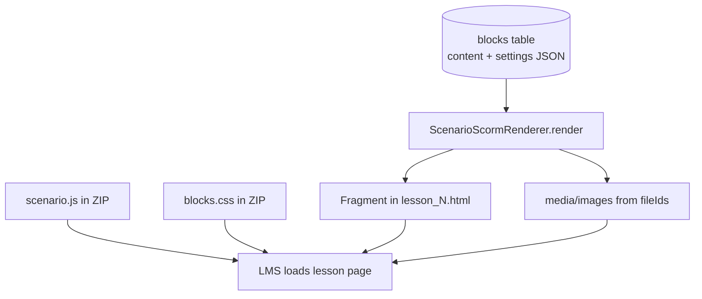
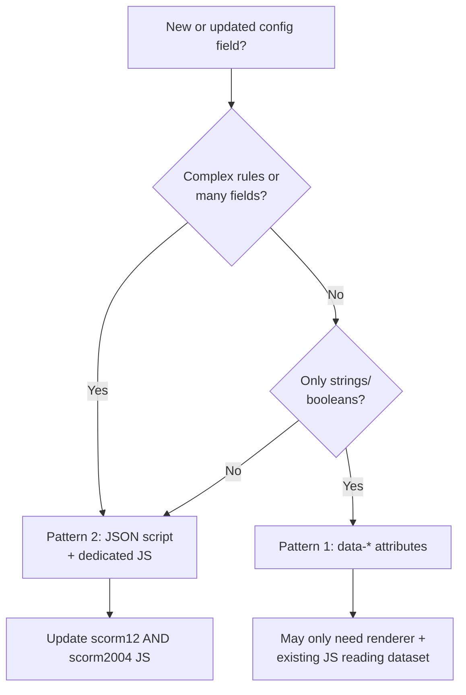

# SCORM Export — Blocks, Configuration, and Version Guide

**Standalone reference.** This document is self-contained: you do not need other SCORM export write-ups to understand the flow, add blocks, wire configuration, or support SCORM 1.2 / 2004.

**Purpose:** Explain how course content becomes a SCORM package, how to add new blocks (especially **SCENARIO**), how to wire **configuration** into blocks that already export without author settings, and how **SCORM 1.2**, **SCORM 2004 (3rd / 4th Edition)**, and **package-level tracking** interact with that work.

**Audience:** Backend and frontend developers on Course Forge (`course-forge-backend` export, `course-forge-frontend` preview parity).

**Repository roots (paths below are relative to the monorepo):**

- Backend: `course-forge-backend/`
- Frontend: `course-forge-frontend/`

**Last updated:** 2026-05-20

---

## Table of contents

0. [The four questions — detailed answers](#0-the-four-questions--detailed-answers)
1. [Export flow overview](#1-export-flow-overview)
2. [Question 1 — How to introduce a new block (SCENARIO)](#2-question-1--how-to-introduce-a-new-block-scenario)
3. [Question 2 — How to update existing elements with configuration](#3-question-2--how-to-update-existing-elements-with-configuration)
4. [Question 3 — SCORM 1.2 vs 2004, editions, and package settings impact](#4-question-3--scorm-12-vs-2004-editions-and-package-settings-impact)
5. [Question 4 — Changes in 1.2 and 2004 (3rd & 4th) for questions 1 and 2](#5-question-4--changes-in-12-and-2004-3rd--4th-for-questions-1-and-2)
6. [Current block coverage snapshot](#6-current-block-coverage-snapshot)
7. [Recommended implementation order for SCENARIO](#7-recommended-implementation-order-for-scenario)
8. [Code reference index](#8-code-reference-index)
9. [Appendix A — SCENARIO content model](#appendix-a--scenario-content-model)
10. [Appendix B — Example export API request](#appendix-b--example-export-api-request)

---

## 0. The four questions — detailed answers

This section maps directly to the four analysis questions. Each answer is expanded in its own chapter below.

### Question 1 — How do you introduce a new block in the SCORM package? (Example: SCENARIO)

**Short answer:** A “block” in the LMS is not a separate SCORM SCO per block. It is an **HTML fragment** inside `lessons/lesson_N.html`, produced at export time by a **Java renderer**, styled with **CSS**, and made interactive with **JavaScript** copied into the ZIP. For SCENARIO you must add all three layers plus **media extraction** so images exist in the package.

**What happens today for SCENARIO:** The export pipeline runs, but no renderer exists. The legacy switch has no `case SCENARIO`, so the learner sees `Unsupported block type: SCENARIO` inside the lesson page. The rest of the package (manifest, navigation, other blocks) is fine.

**What you must build:**

| # | Deliverable | Why it is required |
|---|-------------|-------------------|
| 1 | `ScenarioScormRenderer` (`@Component`) | Turns DB `blocks.content` JSON into HTML embedded in the lesson |
| 2 | `scenario.js` in **both** template folders | Branching UI runs in the browser offline inside the LMS |
| 3 | CSS in **both** `blocks.css` files | Layout matches course preview |
| 4 | `lesson-template.html` script tag × 2 | Loads `scenario.js` on every lesson page |
| 5 | `copyScorm12Templates` / `copyScorm2004Templates` | Copies `scenario.js` into the ZIP |
| 6 | `extractFileIdsFromBlockContent` for `SCENARIO` × 2 | Background/character images are physically in `media/images/` |

**You do not** create a new `exportType`, a new API, or separate SCORM manifest items per block. One Java renderer is shared by SCORM 1.2 and 2004.

→ Full walkthrough: [Section 2](#2-question-1--how-to-introduce-a-new-block-scenario).

---

### Question 2 — How do you update the SCORM package so existing elements use their configuration?

**Short answer:** Configuration lives in the database as JSON (`blocks.content` and often `blocks.settings`). Many export renderers currently output **default structure only** (e.g. step flow with default label “Step”, checkpoint with default button text). You fix this by **reading the same JSON fields the editor preview uses**, serializing them into the exported HTML (`data-*` attributes or a JSON `<script>` tag), and teaching the matching **`*.js`** in the package to read those values at runtime.

**What “without configuration” means in practice:**

- **Content** (text, images, steps, cards) is often exported — authors see their words and media.
- **Behavior and layout options** (step label on/off, checkpoint completion rule, audio autoplay, action button destination, carousel order, marker icons) are often **ignored** — learners get hard-coded defaults from the renderer or JS.

**Fix process (repeat per block type):**

1. Open the block’s preview component in the frontend and list every field from `content`, `settings`, and `config`.
2. Update the `*ScormRenderer.java` to parse those fields.
3. Pass them into HTML (Pattern 1: `data-*`, or Pattern 2: JSON script — see Section 3).
4. Update `scorm12/js/…` and `scorm2004/js/…` to honor the values.
5. Add a unit test asserting the exported HTML contains the configured values.

→ Full walkthrough with examples: [Section 3](#3-question-2--how-to-update-existing-elements-with-configuration).

---

### Question 3 — Two SCORM versions (1.2 and 2004): how do you update the package? Impact of completion %, tracking, etc.?

**Short answer:** SCORM **1.2** and **2004** share the **same block HTML generation** (one Java renderer registry). They differ in **LMS runtime** (`scorm-manager.js`), **manifest XML**, and **template file paths**. **3rd vs 4th Edition** only changes the manifest `<schemaversion>` string, not lesson content.

**Package-level settings** (`reporting`, `trackingType`, `completionThreshold`, `passingScore`) are injected into `scorm-manager.js` (and `quiz.js` when using quiz tracking) at export time. They control **course-wide LMS reporting**, not how a single block renders.

| Package setting | Affects block HTML/JS you write? | What it actually controls |
|-----------------|----------------------------------|---------------------------|
| `completionThreshold` + `COURSE_COMPLETION` | No (unless you hook block events) | % of **lessons** marked complete before course is “complete” in LMS |
| `passingScore` + `QUIZ_RESULT` | No (quiz block only) | Whether quiz score ≥ threshold → pass/fail in LMS |
| `reporting` | No | Uses `completed/incomplete` vs `passed/failed` SCORM fields |
| `scorm2004Edition` | No | Manifest schema label only (`3rd` / `4th`) |

**Impact on your block/configuration work:**

- Adding SCENARIO or fixing Step Flow labels **does not require** changing export API fields or `injectConfigurationIntoScormManager`.
- If product wants “finishing the scenario counts toward course completion,” you must explicitly integrate with `simple-navigation.js` / `lesson:block-completed` — that is **separate** from `completionThreshold`.

→ Full comparison and runtime behavior: [Section 4](#4-question-3--scorm-12-vs-2004-editions-and-package-settings-impact).

---

### Question 4 — How do you make changes in SCORM 1.2 and 2004 (3rd & 4th Edition) for questions 1 and 2?

**Short answer:**

| Work | SCORM 1.2 | SCORM 2004 | 3rd / 4th Edition |
|------|-----------|------------|-------------------|
| **Q1 — New block (SCENARIO)** | Java renderer once; duplicate `scenario.js`, CSS, lesson template, copy method, media extraction | Same Java; duplicate under `scorm2004/` | **No extra work** — same assets as 2004 |
| **Q2 — Configuration on existing blocks** | Java renderer once; update **both** `scorm12` and `scorm2004` JS/CSS | Same Java; duplicate JS/CSS | **No extra work** |

**Rule of thumb:** Write Java **once**. Touch **every static asset twice** (under `export-templates/scorm12/` and `export-templates/scorm2004/`). Touch **both** `Scorm12ExportStrategy` and `Scorm2004ExportStrategy` only for **media extraction** (duplicated today).

→ File-by-file checklist: [Section 5](#5-question-4--changes-in-12-and-2004-3rd--4th-for-questions-1-and-2).

---

## 1. Export flow overview

### 1.1 Entry point

Export is triggered via **`POST /export/course`** (`CourseExportController`). The request body (`CourseExportRequestDto`) includes:

| Field | Used when | Purpose |
|-------|-----------|---------|
| `courseId` | Always | Course to export |
| `exportType` | Always | `SCORM_1_2` or `SCORM_2004` |
| `scorm2004Edition` | `SCORM_2004` only | `3rd` or `4th` (default `3rd`) |
| `reporting` | SCORM exports | `completed_incomplete` or `passed_failed` |
| `trackingType` | SCORM exports | `COURSE_COMPLETION` or `QUIZ_RESULT` |
| `completionThreshold` | `COURSE_COMPLETION` | 1–100 (% of lessons) |
| `passingScore` | `QUIZ_RESULT` | 1–100 (quiz %) |
| `packageName` | Optional | ZIP filename base |

`CourseExportService` selects a strategy by `ExportType`:

| `exportType` | Strategy class |
|--------------|----------------|
| `SCORM_1_2` | `Scorm12ExportStrategy` |
| `SCORM_2004` | `Scorm2004ExportStrategy` |

Persistence of export options: `CourseExport` entity (`course_exports` table).

### 1.2 Six phases (both SCORM strategies)

Both strategies run the same high-level pipeline:



| Phase | What happens |
|-------|----------------|
| **1** | Create workspace; generate `index.html`; plan lesson file names (`lesson_1.html`, …) |
| **2** | Copy JS/CSS from `export-templates/scorm12` or `scorm2004`; **inject** reporting/tracking into `scorm-manager.js` (and `quiz.js` if quiz tracking) |
| **3** | For each lesson: load `lesson-template.html`, render all blocks → `{{LESSON_BLOCKS}}`, embed block manifest → `{{LESSON_BLOCK_MANIFEST}}` |
| **4** | Collect `fileId`s from block JSON; copy files into `media/images`, `media/videos` |
| **5** | Generate `imsmanifest.xml` from manifest template |
| **6** | ZIP workspace; cleanup temp folder |

Templates live under:

`course-forge-backend/src/main/resources/export-templates/`

### 1.3 Where blocks become HTML (Phase 3)

For each lesson:

1. Load blocks: `blockService.getBlocksByLessonId(lessonId)`.
2. Build `ScormBlockRenderContext` (course/module/lesson ids, `ObjectMapper`, media path resolver, HTML escape helpers, lesson file map for internal links).
3. For each block, call `generateBlockHtml` → **`ScormBlockHtmlDispatcher.dispatch`**.
4. Wrap output:

```html
<div class="lesson-block"
     data-manifest-index="0"
     data-block-id="..."
     data-block-type="CHECKPOINT">
  <!-- rendered fragment -->
</div>
```

5. Embed lesson manifest (for checkpoint / progress):

```html
<script type="application/json" id="lesson-block-manifest">…</script>
```

Built by `LessonBlockManifestBuilder` — shape: `{ "lessonId": "…", "blocks": [ { "id", "type" }, … ] }`.

### 1.4 Block rendering resolution



**Key classes:**

| Class | Role |
|-------|------|
| `ScormBlockHtmlRenderer` | Interface: `supportedType()` + `render(block, context)` |
| `ScormBlockHtmlRendererRegistry` | One renderer per `Block.BlockType`; duplicate types fail at startup |
| `ScormBlockHtmlDispatcher` | Shared by SCORM 1.2 and 2004 |
| `ScormBlockRenderContext` | Immutable context (media paths, lesson file resolver, etc.) |
| `Scorm12ExportStrategy` / `Scorm2004ExportStrategy` | Legacy `generateBlockHtmlLegacy` switch for unmigrated types |

**Architecture (renderer registry):**

- New block types are implemented as Spring `@Component` classes implementing `ScormBlockHtmlRenderer` under `export/render/blocks/`.
- `ScormBlockHtmlRendererRegistry` collects all renderers at startup; **two renderers for the same `BlockType` cause startup failure** (fail fast).
- `ScormBlockHtmlDispatcher` is shared by SCORM 1.2 and 2004 so block HTML cannot drift between versions.
- If a renderer returns `null` or throws, dispatch falls back to the legacy `generateBlockHtmlLegacy` switch inside each strategy (same behavior as before the registry existed).
- **Backward compatibility:** Existing block types that still use the legacy switch must render the same HTML as before until deliberately migrated to a renderer.

### 1.5 Exported ZIP layout (workspace)

After export, the ZIP roughly contains:

| Path | Description |
|------|-------------|
| `index.html` | Course home / launch into lessons |
| `imsmanifest.xml` | SCORM manifest |
| `lessons/lesson_N.html` | One HTML file per lesson, blocks inside |
| `css/` | `course.css`, `blocks.css`, `sidebar.css` |
| `js/` | `scorm-manager.js`, block scripts, navigation |
| `media/images/`, `media/videos/` | Copied assets from block `fileId`s |

Temp workspace: `{export.temp-dir}/{exportId}/workspace/` (default `./temp/course-exports`).

### 1.6 Lesson page runtime scripts

Each lesson loads (from `lesson-template.html`):

| Script | Role |
|--------|------|
| `scorm-manager.js` | LMS API, course-level completion, reporting |
| `checkpoint.js` | Checkpoint gating, `lesson:block-completed` events |
| `simple-navigation.js` | Sidebar, prev/next, lesson completion markers |
| `quiz.js` | Quiz UI + SCORM score when applicable |
| `flashcards.js`, `tabs.js`, `lesson-carousel.js`, … | Per interactive block family |
| `interactive-image.js`, `sort-and-learn.js`, `step-flow.js` | Matching pluggable blocks |

Block-specific JS is copied in Phase 2 (`copyScorm12Templates` / `copyScorm2004Templates`). **If you add a new interactive block, you must register its JS in both copy methods and both lesson templates.**

---

## 2. Question 1 — How to introduce a new block (SCENARIO)

### 2.0 What “a block in the SCORM package” actually is

Course Forge does **not** emit one SCORM activity per content block. The package is a **mini website**:

- One primary SCO (`index.html`) with internal links to `lessons/lesson_1.html`, `lesson_2.html`, …
- Each lesson page contains **all blocks** for that lesson as sequential HTML inside `<div class="lesson-block">` wrappers.
- `imsmanifest.xml` lists the HTML, JS, CSS, and media files so the LMS can launch and track the course.

Therefore “introducing a block” means: **when export runs, that block type must produce correct HTML + assets in this ZIP**. The LMS never sees a separate “SCENARIO object” — only files on disk.



### 2.1 Current state

- `Block.BlockType.SCENARIO` exists on the entity (`Block.java`). Legacy alias: `DECISION_PATH` → `SCENARIO`.
- Backend validation: `ScenarioContentValidator` (scenes, slides, dialogue, branching, terminal paths).
- Frontend preview: `ScenarioPreview`, `scenario-utils.ts`, `scenario-api-mapper.ts`.
- **Export:** No `ScenarioScormRenderer`. SCENARIO hits legacy `default` → learner sees *“Unsupported block type: SCENARIO”*.

**Product behavior (summary):** A scenario is a branching experience: scenes contain slides or content nodes; dialogue slides offer responses; navigation uses `nextAction` / `goTo` (`next`, `slide`, `end`). Authors can set backgrounds, characters, personas, and whether back navigation is allowed. See [Appendix A](#appendix-a--scenario-content-model) for JSON shapes.

### 2.2 Standard three-layer pattern

Interactive blocks in SCORM export use **Java + CSS + JS**:

| Layer | Responsibility | Examples in codebase |
|-------|----------------|----------------------|
| **Java renderer** | Parse JSON, resolve media paths, emit HTML shell + JSON payload | `CheckpointScormRenderer`, `SortAndLearnScormRenderer`, `StepFlowScormRenderer` |
| **CSS** | Classes in `blocks.css` (often duplicated under `scorm12` and `scorm2004`) | `.lesson-checkpoint`, `.lesson-step-flow` |
| **JS** | Hydrate DOM on load; fire completion events | `checkpoint.js`, `sort-and-learn.js`, `step-flow.js` |

**Checkpoint pattern (configuration → JSON → JS):**

1. Read fields from `block.getContent()` via `BlockRendererSupport.parseMap`.
2. Build a runtime payload map.
3. Serialize to `<script type="application/json" class="lesson-checkpoint-json">`.
4. Empty mount node: `<div class="lesson-checkpoint-inner"></div>`.
5. `checkpoint.js` finds sections, parses JSON, builds UI.

**Sort and Learn pattern:** Same JSON script + root `data-sal-root` + dedicated `sort-and-learn.js`.

### 2.3 Step-by-step: add SCENARIO to the package

#### Step A — Java: `ScenarioScormRenderer`

**Location:** `course-forge-backend/src/main/java/com/mundrisoft/courseforge/export/render/blocks/ScenarioScormRenderer.java`

```java
@Component
public class ScenarioScormRenderer implements ScormBlockHtmlRenderer {
    @Override
    public Block.BlockType supportedType() {
        return Block.BlockType.SCENARIO;
    }

    @Override
    public String render(Block block, ScormBlockRenderContext context) {
        // 1. Parse block.getContent() — support editor + API envelope shapes
        // 2. Normalize scenes/slides/contents/responses/nextAction
        // 3. Resolve fileIds → context.mediaPathResolver().apply(fileId, "images")
        // 4. Include block.getSettings() if needed (e.g. allowBackNavigation)
        // 5. Emit <section class="lesson-scenario"> + JSON script + <div class="lesson-scenario-root"></div>
    }
}
```

Spring picks it up automatically; **no change to export strategies** except media extraction and template copying (below).

**Content shapes to normalize:**

| Source | Shape | Notes |
|--------|--------|-------|
| Editor | `version`, `settings.allowBackNavigation`, `scenes[].contents[]` | Each scene: `background`, `character`, `persona`, `contents[]` with `type: text \| dialogue` |
| API / Rise wire | Root `items[]` of scenes; each scene has `slides[]` with `type: dialogue \| text` | May be wrapped in `{ type: "interactive", items: [...] }` — validator unwraps this |
| Legacy simplified | `content.scenarios[]` | Preview still supports; normalize to editor shape in renderer if encountered |

The renderer must **normalize** these into one runtime JSON payload for `scenario.js`. Rules must match `ScenarioContentValidator` (max 50 scenes, 200 slides per scene, 1–4 dialogue responses, at least one terminal path on publish).

#### Step B — Runtime assets (both SCORM trees)

| Asset | SCORM 1.2 path | SCORM 2004 path |
|-------|----------------|-----------------|
| JS | `export-templates/scorm12/js/scenario.js` | `export-templates/scorm2004/js/scenario.js` |
| CSS | `export-templates/scorm12/css/blocks.css` | `export-templates/scorm2004/css/blocks.css` |

**Wire JS into lesson template** (both files):

`export-templates/scorm12/html/lesson-template.html`  
`export-templates/scorm2004/html/lesson-template.html`

Add after existing block scripts, e.g.:

```html
<script src="../js/scenario.js"></script>
```

**Wire copy in strategies:**

- `Scorm12ExportStrategy.copyScorm12Templates` — `copyResourceFile(..., "scenario.js")`
- `Scorm2004ExportStrategy.copyScorm2004Templates` — same

#### Step C — Media extraction

`copyMediaFiles` uses `extractFileIdsFromBlockContent` in **both** strategies (duplicated logic today).

Add a branch for `BlockType.SCENARIO` collecting at minimum:

- `background.fileId` / nested `backgroundImage`
- `character.fileId` / avatar per scene
- Any slide- or response-level media `fileId`

Without this, HTML may reference `media/images/{fileId}` but files will be missing from the ZIP.

#### Step D — Frontend parity

Use as reference implementations (do not duplicate business rules blindly in Java beyond serialization):

| Frontend | Path |
|----------|------|
| Preview UI | `course-forge-frontend/.../preview/scenario/ScenarioPreview.tsx` |
| Utils | `scenario-utils.ts` |
| API mapping | `scenario-api-mapper.ts` |
| Types | `scenario/types.ts` |

The SCORM renderer should output a **runtime payload** that `scenario.js` can consume the same way the preview consumes normalized state.

#### Step E — Progress / checkpoint integration (optional but recommended)

Many blocks signal completion via a DOM event:

```javascript
document.dispatchEvent(
  new CustomEvent('lesson:block-completed', { detail: { blockId: '…' } })
);
```

**Checkpoint.js** maintains a `TRACKABLE` map of block types that count toward “complete previous / complete all above” rules. If scenarios should gate checkpoints, add `SCENARIO: true` and fire the event when the learner reaches a terminal branch (`goTo=end`, `END_SCENARIO`, etc.).

**Files to update (both versions):**

- `export-templates/scorm12/js/checkpoint.js`
- `export-templates/scorm2004/js/checkpoint.js`

#### Step F — Tests

| Test | Purpose |
|------|---------|
| `ScenarioScormRendererTest` | Payload JSON, escaped `<`, media paths, empty content |
| Export integration (optional) | Fixture course with SCENARIO block → ZIP contains `scenario.js` and image files |

Example test locations: `CoreBlockRenderersTest.java`, `JourneyBlockRenderersTest.java` under `course-forge-backend/src/test/java/.../export/render/blocks/`.

### 2.4 What you do **not** need for a new block

- New REST endpoint or `ExportType` (unless product asks for a new format).
- Changes to `imsmanifest.xml` **unless** you add new file types that must be explicitly listed (current manifest uses a broad `course_index` resource with file entries generated from lessons + assets).
- Separate renderers for SCORM 1.2 vs 2004 — **Java renderers are shared**.

### 2.5 End-to-end: from author save to learner view (SCENARIO)

| Step | System | What happens |
|------|--------|----------------|
| 1 | Editor | Author builds scenario; save stores JSON in `blocks.content` (and possibly `blocks.settings`). |
| 2 | API | `ScenarioContentValidator` validates structure on save/publish. |
| 3 | Export API | Client calls `POST /export/course` with `exportType` SCORM_1_2 or SCORM_2004. |
| 4 | Strategy | `Scorm*ExportStrategy.export` runs six phases (see Section 1). |
| 5 | Phase 3 | For each lesson, `generateBlocksFromData` calls dispatcher → **`ScenarioScormRenderer`** (once implemented). |
| 6 | Renderer | Parses JSON, resolves `fileId` → `../media/images/{id}`, writes `<section class="lesson-scenario">` + JSON script. |
| 7 | Phase 4 | `extractFileIdsFromBlockContent` must include scenario images or paths break. |
| 8 | Phase 2 | `scenario.js` copied into `js/`; `scorm-manager.js` gets tracking config (unaffected by scenario). |
| 9 | ZIP | Learner downloads package; LMS opens `index.html` → lesson with scenario. |
| 10 | Browser | `scenario.js` reads JSON script, mounts UI, handles branches; may fire `lesson:block-completed`. |

### 2.6 How SCENARIO differs from a simple block (e.g. bulleted list)

| Aspect | Simple block (e.g. list) | SCENARIO |
|--------|--------------------------|----------|
| Interactivity | Usually static HTML | Multi-step state machine (scenes, dialogue, branches) |
| JS required | Often none | **Required** (`scenario.js`) |
| Content shape | Flat `items[]` | Graph: scenes, contents/slides, responses, `nextAction` |
| Media | Optional | Background + character images per scene |
| Completion | N/A | Terminal branch; may need checkpoint/LMS hooks |
| Validation | Light | Strict (`ScenarioContentValidator`) |

Use **Pattern 2** (embedded JSON + mount div + dedicated JS), same family as Checkpoint and Sort and Learn — not Pattern 1 alone.

### 2.7 Acceptance criteria (SCENARIO in SCORM)

Before considering SCENARIO “done” in export:

- [ ] Exported ZIP contains `js/scenario.js` and lesson HTML includes the script tag.
- [ ] Scenario with images shows backgrounds/characters (files under `media/images/`).
- [ ] All branch types work offline (next content, jump to slide/scene, end, try again).
- [ ] `allowBackNavigation` from settings respected when false.
- [ ] Editor-shaped and API-shaped content both export without error.
- [ ] SCORM 1.2 and SCORM 2004 packages behave the same in the browser (same HTML; only LMS API wrapper differs).
- [ ] Optional: checkpoint after scenario respects completion if `TRACKABLE` + event implemented.

---

## 3. Question 2 — How to update existing elements with configuration

### 3.1 Problem statement — “elements without configuration”

Recent SCORM work added **visual structure** for many block types (HTML/CSS and sometimes JS shells) so courses no longer show “Unsupported block type” for those types. That is only half of parity with the **course preview**.

**What was typically implemented (structure only):**

- Markup and CSS classes matching preview layout (e.g. step flow slides, carousel track, chart canvas).
- Default button labels, default step label “Step”, default checkpoint “Continue”.
- Hard-coded behavior in `*.js` (e.g. always show step label, always use `completionType: none`).

**What was often not implemented (configuration):**

- Values from `blocks.settings` (layout, labels, toggles).
- Behavioral fields from `blocks.content` (checkpoint `completionType`, `locked`, `trackProgress`; action `actionType` + `destination`; sort groups/correct answers).
- Author-facing options that preview reads via `getBlockSettings(block)` or block-specific editors.

**Result for learners:** Content appears, but **behavior and labels may not match** what the author configured. **Result for authors:** “It works in preview but not in SCORM export.”

**Goal:** For each exported block type, the SCORM package must carry the **same effective configuration** as preview, encoded in HTML/JS at export time (the LMS does not call your API at runtime).

### 3.2 Where configuration lives in the data model

| Source | Column | Used by |
|--------|--------|---------|
| Primary content | `blocks.content` (JSON) | Most renderers — items, steps, locked, completionType, etc. |
| Styling / behavior | `blocks.settings` (JSON) | `StepFlowScormRenderer` (step labels), `AudioPlayerScormRenderer` (layout, playback) |
| Preview fallbacks | `block.config` in API responses | Frontend only today; check if export DTO includes it |

**Entity:** `course-forge-backend/.../entity/Block.java`

### 3.3 Configuration wiring patterns

#### Pattern 1 — Data attributes (simple toggles)

Example: **Step Flow** reads `block.settings` and exposes:

```html
<div class="lesson-step-flow"
     data-step-label="Step"
     data-step-label-enabled="true"
     data-step-count="3">
```

Runtime: `step-flow.js` reads attributes when building the header badge.

**When to use:** Few boolean/string options; no nested graph.

#### Pattern 2 — Embedded JSON script (complex interactives)

Example: **Checkpoint**

```html
<section class="lesson-checkpoint">
  <script type="application/json" class="lesson-checkpoint-json">{…}</script>
  <div class="lesson-checkpoint-inner"></div>
</section>
```

Payload includes: `buttonText`, `hintHtml`, `completionType`, `locked`, `trackProgress`, `blockId`, `lessonId`.

**When to use:** Branching rules, multiple strings, HTML hints, IDs for storage keys.

#### Pattern 3 — Map API enums to runtime strings

Example: `CheckpointScormRenderer.mapCompletionTypeFromApi`:

| API / author value | Runtime value |
|--------------------|---------------|
| `NONE`, `NO` | `none` |
| `PREVIOUS`, `DIRECT` | `complete-previous` |
| `ALL` | `complete-all-above` |

Always accept legacy aliases so old courses still export correctly.

#### Pattern 4 — Resolve links and media in Java

| Need | Use |
|------|-----|
| Images / audio / video file IDs | `context.mediaPathResolver().apply(fileId, "images"\|"videos")` |
| Navigate to another lesson | `context.resolveExportedLessonFile(lessonUuid)` → `lesson_N.html` |
| External URL / mailto | `ActionButtonScormSupport` patterns |

#### Pattern 5 — Inline CSS when LMS strips stylesheets

Some LMS shells override `.lesson-content ul` or ignore `blocks.css`. **Lists** use `ListScormHtml` inline styles; **Interactive Image** uses inline modal styles for the same reason.

If configuration affects layout critical in LMS, consider `data-*` + inline critical CSS, not only class names.

### 3.4 Per-block configuration checklist

For each existing `*ScormRenderer.java`:

1. **Inventory** — In frontend preview (`blockRenderer.tsx` or block-specific preview), list every prop derived from `content`, `settings`, or `config`.
2. **Parse** — Extend renderer to read those keys; use `BlockRendererSupport` helpers.
3. **Serialize** — Add to JSON script and/or `data-*` attributes.
4. **Runtime** — Update matching `export-templates/**/js/*.js` ( **both** `scorm12` and `scorm2004` copies).
5. **Verify** — Unit test renderer output; manual LMS import.

**Examples of configuration often missed:**

| Block | Typical settings / content fields |
|-------|-----------------------------------|
| Step Flow | `settings.label`, `stepLabel`, `stepLabelEnabled`, hidden steps |
| Checkpoint | `completionType`, `locked`, `trackProgress`, `hintText`, `labelText` |
| Audio Player | `settings.layout`, `settings.playback` |
| Action Button | `actionType`, `destination`, `supportingText` |
| Image Carousel | captions, order, alt text (partially done) |
| Interactive Image | marker icons, modal content, marker order |
| Sort and Learn | groups, cards, correct mapping |

### 3.5 Shared utilities

| Utility | Path |
|---------|------|
| `BlockRendererSupport` | `export/render/blocks/BlockRendererSupport.java` |
| `ListScormHtml` | Inline list styles |
| `ScormChartColorUtil` | Chart colors from content |
| `ScormMediaFileIdUtil` | Collect file IDs from nested maps |
| `ActionButtonScormSupport` | CTA types and lesson navigation |

### 3.6 Worked example — Checkpoint (configuration end-to-end)

**Author configures in editor:** Button label “Proceed”, hint text, completion rule “All blocks above”, locked until met, track progress in localStorage.

**Database (`blocks.content` JSON):** Fields such as `labelText` or `buttonText`, `hintText`, `completionType` / `completionRule` (`ALL`, `PREVIOUS`, `NONE`), `locked: true`, `trackProgress: true`.

**Export (`CheckpointScormRenderer`):**

1. `BlockRendererSupport.parseMap(block.getContent(), context)`.
2. `mapCompletionTypeFromApi` converts `ALL` → `complete-all-above`.
3. Builds payload map; writes `<script type="application/json" class="lesson-checkpoint-json">` with escaped JSON.
4. Empty `<div class="lesson-checkpoint-inner">` for JS to fill.

**Package runtime (`checkpoint.js`):**

1. Reads `#lesson-block-manifest` for block order and types.
2. Finds `.lesson-checkpoint` sections; parses JSON script per section.
3. If `locked`, disables button until trackable blocks above fire `lesson:block-completed`.
4. Uses `completionType` to decide which prior blocks must complete.

**If configuration were missing:** Renderer would omit `completionType` → JS defaults to `none` → checkpoint never gates — **author’s “complete all above” is ignored**.

### 3.7 Worked example — Step Flow (settings in `blocks.settings`)

**Author configures:** Custom step label “Phase”, hide step label badge.

**Database:** `blocks.settings` JSON, e.g. `{ "stepLabel": { "enabled": false, "text": "Phase" } }` or flat `stepLabelEnabled` / `stepLabelText`.

**Export (`StepFlowScormRenderer.readLabelSettings`):** Reads `block.getSettings()` (not only content); sets `data-step-label` and `data-step-label-enabled` on root div.

**Package runtime (`step-flow.js`):** Reads `dataset.stepLabel` / `dataset.stepLabelEnabled` when updating header.

**If configuration were missing:** HTML always shows default “Step” with label enabled — author toggle has no effect.

### 3.8 Where to find configuration in the editor (inventory step)

For each `*ScormRenderer`, open the matching preview or editor:

| Block family | Frontend starting point |
|--------------|-------------------------|
| Generic | `course-forge-frontend/.../preview/blockRenderer.tsx` — `case` for block type |
| Dedicated preview | e.g. `.../preview/scenario/ScenarioPreview.tsx`, `.../interactive-image/InteractiveImagePreview.tsx` |
| Editor panel | `blockSetting.tsx`, block-specific editor under `.../editor/` |
| Normalization | `block-normalization.ts`, `getBlockSettings(block)` |

Document every field that affects learner-visible behavior. That list is the **contract** for the SCORM renderer + JS update.

### 3.9 Decision tree — which wiring pattern?



### 3.10 Priority list for configuration backfill

Suggested order (highest learner impact first):

1. **CHECKPOINT** — gating and completion rules (already partially implemented; verify all API enum values).
2. **ACTION_BUTTON / ACTION_BUTTON_GROUP** — wrong link type breaks navigation.
3. **STEP_FLOW** — settings for labels and hidden steps.
4. **SORT_AND_LEARN / DRAG_AND_DROP / QUIZ** — scoring and completion affect progress events.
5. **INTERACTIVE_IMAGE** — marker content and order.
6. **AUDIO_PLAYER** — autoplay, layout from `settings`.
7. **Charts, carousels, lists** — colors, order, captions (often content-only but verify).

### 3.11 Verification checklist (per block after config fix)

- [ ] Export course containing block with non-default settings.
- [ ] Unzip; locate lesson HTML; confirm JSON script or `data-*` contains author values (view source).
- [ ] Open lesson in browser (or LMS); behavior matches preview.
- [ ] Repeat for **SCORM 1.2** and **SCORM 2004** ZIP (HTML should be identical; JS paths same).
- [ ] Unit test: renderer output includes configured string/value.

---

## 4. Question 3 — SCORM 1.2 vs 2004, editions, and package settings impact

### 4.1 What is shared vs different

| Area | Shared? | Notes |
|------|---------|-------|
| `ScormBlockHtmlDispatcher` + all `*ScormRenderer` | **Yes** | Single Java codebase |
| `generateBlockHtmlLegacy` switch | **Duplicated** per strategy | Same cases; migrate types to renderers to avoid drift |
| `extractFileIdsFromBlockContent` | **Duplicated** | Add new block media rules in **both** strategies |
| Lesson HTML structure | Nearly identical | `scorm12` vs `scorm2004` `lesson-template.html` |
| `scorm-manager.js` | **Different files** | 1.2: `LMS*` API, `cmi.core.*`; 2004: `Initialize` / `GetValue`, `cmi.completion_status`, etc. |
| `blocks.css` | **Separate files** | Keep visual parity manually |
| `course.css` | 2004 reuses 1.2 | See `Scorm2004ExportStrategy.copyScorm2004Templates` |
| `imsmanifest.xml` | Different templates | Under `scorm12/manifest` vs `scorm2004/manifest` |

### 4.2 SCORM 2004 — 3rd vs 4th Edition

Controlled by `CourseExport.scorm2004Edition` (`3rd` default).

**Only effect in current code:** `generateScorm2004Manifest` replaces manifest placeholder:

- `2004 3rd Edition` → `2004 4th Edition` in `<schemaversion>` when edition is `4th`.

**No impact on:**

- Block HTML, CSS, or JS
- Renderer logic
- Media copy
- Tracking injection

LMS compatibility: choose edition to match LMS manifest validation; content authors rarely see a difference inside lessons.

### 4.3 Package-level settings (export request / `CourseExport`)

These are **course-wide LMS behaviors**, injected at export time into JavaScript — **not** per-block renderer fields.

| Setting | Injected into | Behavior |
|---------|---------------|----------|
| `reporting` | `scorm-manager.js` → `this.reportingType` | `completed_incomplete` uses lesson status; `passed_failed` uses pass/fail semantics |
| `trackingType` | `scorm-manager.js` → `this.trackingType` | `COURSE_COMPLETION` or `QUIZ_RESULT` or null |
| `completionThreshold` | `scorm-manager.js` | % of lessons that must be completed (with `totalLessons` counted at export) |
| `passingScore` | `scorm-manager.js` and optionally `quiz.js` | Minimum quiz % for `QUIZ_RESULT` |
| `scorm2004Edition` | `imsmanifest.xml` only | Schema version string |

**Injection method:** `injectConfigurationIntoScormManager` in both strategies reads the template from classpath, regex-replaces after `this.interactions = [];`, writes to workspace `js/scorm-manager.js`.

### 4.4 Impact of package settings on block work (points 1 and 2)

| Question | Answer |
|----------|--------|
| Do I change renderers when `completionThreshold` changes? | **No** — unless the block must participate in lesson completion. |
| How is course completion % calculated? | **Lesson-based** via `simple-navigation.js` + `scorm-manager.js` (`markLessonCompleted`, threshold vs `totalLessons`). |
| Do blocks automatically count toward course %? | **No** — visiting/completing a lesson does; per-block completion is optional via events. |
| Quiz tracking | `QUIZ_RESULT` + `passingScore` affects `quiz.js` and score fields in `scorm-manager.js`. |
| Checkpoint blocks | Use `checkpoint.js` + lesson manifest; separate from course % but can block navigation until trackable blocks fire `lesson:block-completed`. |

**Implications for SCENARIO:**

- Exporting a working scenario does **not** require changing `reporting` or `trackingType`.
- If product requires “scenario must be finished for lesson/course completion,” implement terminal-branch detection in `scenario.js` and call the same completion hooks as quizzes (`lesson:block-completed` and/or lesson completion via navigation manager).
- Course completion % will **not** reflect scenario progress until integrated with that model.

### 4.5 SCORM API differences (for block authors)

If a block’s JS talks to the LMS directly (most do via global `scormManager`):

| Concern | SCORM 1.2 | SCORM 2004 |
|---------|-----------|------------|
| Initialize | `LMSInitialize("")` | `Initialize("")` |
| Status | `cmi.core.lesson_status` | `cmi.completion_status` / `cmi.success_status` |
| Score | `cmi.core.score.raw` | `cmi.score.raw` (via wrapper in manager) |

Prefer going through **`scorm-manager.js`** abstractions rather than raw API calls from new `scenario.js`.

### 4.6 How to “update the SCORM package” when you have two versions

There is **one export pipeline** with **two strategy classes**. Choosing the version is only the `exportType` (and `scorm2004Edition` for 2004):

| Client sends | Strategy used | Template root |
|--------------|---------------|---------------|
| `exportType: SCORM_1_2` | `Scorm12ExportStrategy` | `export-templates/scorm12/` |
| `exportType: SCORM_2004`, `scorm2004Edition: 3rd` | `Scorm2004ExportStrategy` | `export-templates/scorm2004/` + manifest `2004 3rd Edition` |
| `exportType: SCORM_2004`, `scorm2004Edition: 4th` | Same strategy | Same templates + manifest `2004 4th Edition` |

**Updating the package** for a new block or configuration means: change shared Java + update assets in **both** template trees (Section 5). You do **not** maintain two separate block implementations for 1.2 vs 2004.

### 4.7 Package settings explained in detail

#### `reporting` — `completed_incomplete` vs `passed_failed`

- Controls which SCORM data model fields `scorm-manager.js` prefers when marking the **course** complete.
- **`completed_incomplete`:** Uses lesson/course status style familiar to SCORM 1.2 (`cmi.core.lesson_status` / 2004 completion status) with values like `completed` / `incomplete`.
- **`passed_failed`:** Emphasizes pass/fail semantics (and score where applicable).
- **Impact on blocks:** Block HTML is unchanged. Only when the manager commits **course-level** status does reporting matter.

#### `trackingType: COURSE_COMPLETION` + `completionThreshold`

**At export time** (`injectConfigurationIntoScormManager`):

```javascript
this.trackingType = "COURSE_COMPLETION";
this.completionThreshold = 80;  // example
this.totalLessons = 12;         // counted from course structure
```

**At runtime:**

1. `simple-navigation.js` marks individual lessons visited/completed (e.g. when learner reaches last slide or navigates away).
2. `scorm-manager.js` counts how many lessons are complete vs `totalLessons`.
3. When `(completedLessons / totalLessons) * 100 >= completionThreshold`, the manager sets course completion in the LMS.

**Important:** This is **lesson-granular**, not block-granular. A lesson with 10 blocks is one unit — visiting the lesson page may mark it complete even if the learner did not finish every block, unless you add block-level gates (checkpoints) or custom logic.

**Impact on adding SCENARIO or fixing config:** None, unless you explicitly call `markLessonCompleted` or fire events that navigation listens to when the scenario ends.

#### `trackingType: QUIZ_RESULT` + `passingScore`

- Injected into `scorm-manager.js` and **`quiz.js`** (`this.passingScore`).
- Course pass/fail derives from **quiz score** (aggregated in manager), not lesson count.
- **Impact on blocks:** Only **QUIZ** blocks (and code that writes `cmi.*.score`) matter. Scenario/step-flow configuration changes do not affect quiz tracking.

#### `scorm2004Edition` — `3rd` vs `4th`

- Only `generateScorm2004Manifest` substitutes `<schemaversion>2004 3rd Edition</schemaversion>` vs `4th`.
- Some LMS validators reject wrong edition strings; pick the edition your customer’s LMS expects.
- **Zero impact** on lesson HTML, block renderers, `completionThreshold`, or `scenario.js`.

### 4.8 Impact matrix — what changes affect what?

| You are changing… | Block HTML (renderers) | Block JS (`checkpoint.js`, etc.) | `scorm-manager.js` injection | `imsmanifest.xml` |
|-------------------|------------------------|----------------------------------|------------------------------|-------------------|
| New SCENARIO block | **Yes** — new renderer | **Yes** — new `scenario.js` | No | Auto-includes new files in resources |
| Step flow label from settings | **Yes** — read `settings` | **Yes** — read `data-*` | No | No |
| Export `completionThreshold` 80→90 | No | No | **Yes** — re-export only | No |
| Switch 1.2 → 2004 export | Same HTML (shared Java) | Different copy of JS files | Different `scorm-manager.js` template | Different manifest template |
| 2004 3rd → 4th edition | No | No | No | **Yes** — schema string only |

### 4.9 Common misconceptions

| Misconception | Reality |
|---------------|---------|
| “Course completion % reads block progress” | Default: **lesson** completion only. Block events are optional. |
| “I must implement SCENARIO twice for 1.2 and 2004” | **One** Java renderer; duplicate static assets only. |
| “4th Edition needs different scenario.js” | **No** — edition is manifest-only today. |
| “Changing passingScore affects checkpoint text” | **No** — unrelated systems. |
| “Configuration is stored in the ZIP separately” | Config is **baked into** HTML/JS at export time from DB JSON. |

---

## 5. Question 4 — Changes in 1.2 and 2004 (3rd & 4th) for questions 1 and 2

### 5.0 Summary table (questions 1 and 2 × SCORM variants)

|  | SCORM 1.2 | SCORM 2004 (3rd or 4th) |
|--|-----------|-------------------------|
| **Q1 New block — Java** | `ScenarioScormRenderer.java` (shared) | Same file |
| **Q1 New block — JS/CSS** | `export-templates/scorm12/js`, `css` | `export-templates/scorm2004/js`, `css` |
| **Q1 New block — lesson template** | `scorm12/html/lesson-template.html` | `scorm2004/html/lesson-template.html` |
| **Q1 New block — copy in strategy** | `Scorm12ExportStrategy.copyScorm12Templates` | `Scorm2004ExportStrategy.copyScorm2004Templates` |
| **Q1 New block — media IDs** | `Scorm12ExportStrategy.extractFileIdsFromBlockContent` | `Scorm2004ExportStrategy.extractFileIdsFromBlockContent` |
| **Q2 Config — Java** | Shared renderer change | Same |
| **Q2 Config — JS/CSS** | Both `scorm12` and `scorm2004` copies | Both copies |
| **Q2 Config — manifest** | Not required | Not required |
| **Edition 3rd vs 4th** | N/A | Manifest `<schemaversion>` only |

### 5.1 Question 1 — Introduce SCENARIO (or any new interactive block)

| Work item | SCORM 1.2 | SCORM 2004 | 3rd / 4th Edition |
|-----------|-----------|------------|-------------------|
| `*ScormRenderer.java` | Once (shared) | Once | N/A |
| `scenario.js` + CSS | `export-templates/scorm12/...` | `export-templates/scorm2004/...` | Same for both editions |
| `lesson-template.html` script tag | `scorm12/html/lesson-template.html` | `scorm2004/html/lesson-template.html` | Same |
| `copyScorm*Templates` | `Scorm12ExportStrategy` | `Scorm2004ExportStrategy` | Same |
| `extractFileIdsFromBlockContent` | Both strategy classes | Both | Same |
| `checkpoint.js` TRACKABLE (if needed) | `scorm12/js/checkpoint.js` | `scorm2004/js/checkpoint.js` | Same |
| `imsmanifest.xml` | Regenerated each export; new files usually picked up by resource generator | Same | Only `<schemaversion>` differs by edition |

### 5.2 Question 2 — Add configuration to existing blocks

| Work item | SCORM 1.2 | SCORM 2004 | 3rd / 4th Edition |
|-----------|-----------|------------|-------------------|
| Java renderer updates | Shared | Shared | N/A |
| Block-specific JS/CSS | Update **both** template trees | Update **both** | N/A |
| `scorm-manager.js` | Only if block calls LMS APIs for completion/score | Separate file, same injection pattern | N/A |
| Manifest | Rarely needed for config-only changes | Same | No impact |

### 5.3 Duplication risk

Today **`extractFileIdsFromBlockContent`** and large parts of **`generateBlockHtmlLegacy`** exist in both strategies. When adding media rules or migrating legacy types:

- Update **both** `Scorm12ExportStrategy` and `Scorm2004ExportStrategy`, **or**
- Extract a shared helper (future refactor) to prevent 1.2/2004 drift.

### 5.4 File-by-file checklist — Question 1 (SCENARIO)

Use this as a PR checklist. Paths relative to `course-forge-backend/`.

**Java (once):**

- [ ] `src/main/java/.../export/render/blocks/ScenarioScormRenderer.java` — `@Component`, implements `ScormBlockHtmlRenderer`
- [ ] `src/test/java/.../export/render/blocks/ScenarioScormRendererTest.java`

**SCORM 1.2 templates:**

- [ ] `src/main/resources/export-templates/scorm12/js/scenario.js` (new)
- [ ] `src/main/resources/export-templates/scorm12/css/blocks.css` (styles)
- [ ] `src/main/resources/export-templates/scorm12/html/lesson-template.html` — `<script src="../js/scenario.js">`
- [ ] `Scorm12ExportStrategy.copyScorm12Templates` — copy `scenario.js`
- [ ] `Scorm12ExportStrategy.extractFileIdsFromBlockContent` — `case SCENARIO`

**SCORM 2004 templates (same artifacts, `scorm2004` paths):**

- [ ] `export-templates/scorm2004/js/scenario.js`
- [ ] `export-templates/scorm2004/css/blocks.css`
- [ ] `export-templates/scorm2004/html/lesson-template.html`
- [ ] `Scorm2004ExportStrategy.copyScorm2004Templates`
- [ ] `Scorm2004ExportStrategy.extractFileIdsFromBlockContent`

**Optional integration:**

- [ ] `scorm12/js/checkpoint.js` and `scorm2004/js/checkpoint.js` — `TRACKABLE.SCENARIO`
- [ ] Manual: export 1.2 + 2004 (3rd + 4th) ZIPs; LMS smoke test

**Not required for 3rd/4th:** No extra files beyond manifest string when using `scorm2004Edition: 4th`.

### 5.5 File-by-file checklist — Question 2 (configuration on one existing block)

Example: fixing **Step Flow** step label settings.

**Java (once):**

- [ ] `StepFlowScormRenderer.java` — confirm all `settings` keys from editor are read and emitted on `data-*` or JSON

**SCORM 1.2:**

- [ ] `export-templates/scorm12/js/step-flow.js` — read `dataset.stepLabel`, `dataset.stepLabelEnabled`
- [ ] `blocks.css` if new visual states depend on config

**SCORM 2004:**

- [ ] `export-templates/scorm2004/js/step-flow.js` — **same logic** as 1.2 copy
- [ ] `export-templates/scorm2004/css/blocks.css` — keep in sync

**Not touched for config-only:**

- [ ] `imsmanifest.xml` templates
- [ ] `injectConfigurationIntoScormManager` (unless block reports score/completion to LMS directly)
- [ ] `scorm2004Edition` field

### 5.6 Testing matrix (both questions)

| Test | Q1 SCENARIO | Q2 Config fix |
|------|-------------|---------------|
| Unit: renderer output | Required | Required |
| Export SCORM 1.2 ZIP | Required | Required |
| Export SCORM 2004 3rd ZIP | Required | Required |
| Export SCORM 2004 4th ZIP | Manifest only difference | Same as 3rd |
| Browser open lesson HTML locally | Recommended | Recommended |
| LMS import | Recommended | Recommended |
| With `COURSE_COMPLETION` + threshold | Optional integration test | Usually N/A |
| With checkpoint + `ALL` rule above block | Optional | Required for checkpoint config |

---

## 6. Current block coverage snapshot

*Verify the authoritative list in the codebase: `grep "return Block.BlockType" export/render/blocks/*ScormRenderer.java`.*

### 6.1 Pluggable renderers (registry)

Registered types include (non-exhaustive; see codebase for authoritative list):

`ACTION_BUTTON`, `ACTION_BUTTON_GROUP`, `ANNOUNCEMENT`, `ANNOUNCEMENT_NOTE`, `AUDIO_PLAYER`, `BANNER_IMAGE`, `BAR_CHART`, `BULLETED_LIST`, `CHECKBOX_LIST`, `CHECKPOINT`, `CODE_EXAMPLE`, `DISTRIBUTION_CHAT`, `DRAG_AND_DROP`, `EMBED`, `FLASH_CARDS_STACK`, `IMAGE_CAROUSEL`, `IMAGE_GRID`, `INTERACTIVE_IMAGE`, `NUMBERED_LIST`, `QUOTE_CAROUSEL`, `QUOTE_WITH_IMAGE`, `RESOURCE_FILE`, `SECTION_BREAK`, `SORT_AND_LEARN`, `SPACING`, `STEP_FLOW`, `STEP_MARKER`, `SUBHEADING_ONLY`, `TABLE`, `TEXT_WITH_SUBHEADING`, `TIMELINE_VIEW`, `TREND_CHAT`, and related journey blocks.

### 6.2 Legacy switch only (still in strategy)

Includes foundational types such as:

`TITLE`, `TEXT`, `IMAGE`, `VIDEO`, `QUIZ`, `SUMMARY`, heading/quote/column layouts, video layouts, `FLASH_CARDS` / `FLASH_CARDS_GRID`, `TAB`, `ACCORDION`.

### 6.3 Not supported in export (renderer + legacy)

**`SCENARIO`** → unsupported message.

Other types may still show unsupported if not in registry or legacy switch (e.g. some assessment types — confirm per `Block.BlockType` enum).

### 6.4 SCENARIO status summary

| Layer | Status |
|-------|--------|
| Entity / validation | Done |
| Frontend editor + preview | Done |
| SCORM renderer | **Missing** |
| SCORM JS/CSS | **Missing** |
| Media extraction | **Missing** |
| Checkpoint trackable | **Not configured** |

---

## 7. Recommended implementation order for SCENARIO

1. **`ScenarioScormRenderer`** + unit tests (payload, media paths, content shape normalization).
2. **`scenario.js`** + CSS in **both** `scorm12` and `scorm2004` templates; wire `lesson-template.html` and `copyScorm*Templates`.
3. **`extractFileIdsFromBlockContent`** for `SCENARIO` in both strategies.
4. **Content normalization** — editor `contents` vs API `slides`; align with `ScenarioContentValidator`.
5. **Configuration** — `settings.allowBackNavigation`, scene persona, blur, showCharacter, block title/description.
6. **Progress** — terminal branch → `lesson:block-completed`; optional `TRACKABLE` in `checkpoint.js`.
7. **QA** — Export SCORM 1.2, SCORM 2004 (3rd and 4th); import to target LMS(s); test with `COURSE_COMPLETION` threshold and with checkpoints enabled.

---

## 8. Code reference index

### Backend — export core

| Topic | Path |
|-------|------|
| SCORM 1.2 strategy | `course-forge-backend/.../export/strategy/Scorm12ExportStrategy.java` |
| SCORM 2004 strategy | `course-forge-backend/.../export/strategy/Scorm2004ExportStrategy.java` |
| Export service | `course-forge-backend/.../export/service/CourseExportService.java` |
| Export API | `course-forge-backend/.../export/controller/CourseExportController.java` |
| Export entity | `course-forge-backend/.../export/entity/CourseExport.java` |
| Dispatcher | `course-forge-backend/.../export/render/ScormBlockHtmlDispatcher.java` |
| Registry | `course-forge-backend/.../export/render/ScormBlockHtmlRendererRegistry.java` |
| Render context | `course-forge-backend/.../export/render/ScormBlockRenderContext.java` |
| Lesson manifest | `course-forge-backend/.../export/LessonBlockManifestBuilder.java` |
| Block renderers | `course-forge-backend/.../export/render/blocks/*ScormRenderer.java` |

### Templates

| Topic | Path |
|-------|------|
| SCORM 1.2 templates | `course-forge-backend/src/main/resources/export-templates/scorm12/` |
| SCORM 2004 templates | `course-forge-backend/src/main/resources/export-templates/scorm2004/` |
| Lesson template (1.2) | `.../scorm12/html/lesson-template.html` |
| Lesson template (2004) | `.../scorm2004/html/lesson-template.html` |
| Manifest (2004) | `.../scorm2004/manifest/imsmanifest.xml` |

### Scenario domain

| Topic | Path |
|-------|------|
| Block type | `course-forge-backend/.../entity/Block.java` |
| Validation | `course-forge-backend/.../scenario/validation/ScenarioContentValidator.java` |
| Frontend types | `course-forge-frontend/.../scenario/types.ts` |
| API mapper | `course-forge-frontend/.../scenario/api/scenario-api-mapper.ts` |
| Preview | `course-forge-frontend/src/features/editor/components/blocks/preview/blockRenderer.tsx` (SCENARIO case) |

### Tests

| Topic | Path |
|-------|------|
| Registry tests | `course-forge-backend/.../export/render/ScormBlockHtmlRendererRegistryTest.java` |
| Core renderers | `course-forge-backend/.../export/render/blocks/CoreBlockRenderersTest.java` |
| Journey renderers | `course-forge-backend/.../export/render/blocks/JourneyBlockRenderersTest.java` |

---

## Appendix A — SCENARIO content model

### Editor shape (`ScenarioContentRoot`)

Stored in `blocks.content` when saved from the Course Forge editor:

```json
{
  "version": 1,
  "settings": { "allowBackNavigation": true },
  "title": "Optional block title",
  "description": "Optional intro",
  "scenes": [
    {
      "id": "scene-1",
      "title": "Scene title",
      "orderIndex": 0,
      "persona": "female",
      "defaultExpression": "neutral",
      "showCharacter": true,
      "blurBackground": false,
      "description": "",
      "background": { "fileId": "uuid-or-null", "altText": "" },
      "character": { "fileId": "uuid-or-null", "altText": "" },
      "contents": [
        {
          "id": "content-1",
          "orderIndex": 0,
          "type": "text",
          "heading": "",
          "text": "<p>HTML body</p>",
          "showCharacter": true,
          "expression": "neutral",
          "description": "",
          "nextAction": { "type": "NEXT_CONTENT" }
        },
        {
          "id": "content-2",
          "orderIndex": 1,
          "type": "dialogue",
          "heading": "",
          "text": "Prompt text",
          "showCharacter": true,
          "expression": "neutral",
          "description": "",
          "responses": [
            {
              "id": "resp-1",
              "orderIndex": 0,
              "text": "Choice A",
              "expression": "neutral",
              "feedback": "",
              "description": "",
              "nextAction": { "type": "END_SCENARIO" }
            }
          ]
        }
      ]
    }
  ]
}
```

### `nextAction.type` values (editor)

| Type | Meaning |
|------|---------|
| `NEXT_CONTENT` | Next slide/content in scene |
| `SPECIFIC_CONTENT` | Jump to `targetContentId` |
| `ANOTHER_SCENE` | Jump to `targetSceneId` (first content) |
| `NEXT_SCENE` | Next scene in order |
| `END_SCENARIO` | Terminal — scenario complete |
| `TRY_AGAIN` | Retry current dialogue |

### API / Rise wire shape (validator)

Validator expects root **`items`** array of scenes. Each scene has **`slides`** (not `contents`). Slide `type` is `text` or `dialogue`. Branching uses **`goTo`**: `next`, `slide`, or `end`, plus optional **`nextSlide`**: `{ "scene": "...", "slide": "..." }` when `goTo` is `slide`.

Limits enforced server-side:

| Rule | Limit |
|------|--------|
| Scenes | 1–50 |
| Slides per scene | 1–200 |
| Dialogue responses | 1–4 |
| Publish | At least one terminal branch (`goTo=end` or equivalent) |

### SCORM export normalization checklist

1. Detect wire vs editor shape (presence of `items`+`slides` vs `scenes`+`contents`).
2. Build a single runtime graph: scenes → nodes → responses → resolved `next` targets (scene/slide ids).
3. Resolve all `fileId` to `../media/images/{fileId}` (or empty placeholder).
4. Pass `settings.allowBackNavigation`, block title/description, scene-level flags into JSON for `scenario.js`.
5. On terminal branch, optionally dispatch `lesson:block-completed` with `block.id`.

---

## Appendix B — Example export API request

**Endpoint:** `POST /export/course`  
**Controller:** `CourseExportController`  
**Body (JSON):**

```json
{
  "courseId": "your-course-uuid",
  "exportType": "SCORM_2004",
  "scorm2004Edition": "3rd",
  "reporting": "completed_incomplete",
  "trackingType": "COURSE_COMPLETION",
  "completionThreshold": 80,
  "packageName": "my-course"
}
```

**SCORM 1.2 example** — set `"exportType": "SCORM_1_2"` and omit `scorm2004Edition`.

**Quiz-based completion example:**

```json
{
  "courseId": "your-course-uuid",
  "exportType": "SCORM_1_2",
  "reporting": "passed_failed",
  "trackingType": "QUIZ_RESULT",
  "passingScore": 70
}
```

Response is the ZIP file stream (not `ApiResponseDto`); see `CourseExportController.exportCourse`.

---

## Document history

| Date | Change |
|------|--------|
| 2026-05-20 | Initial guide: export flow, new block (SCENARIO), configuration, versions, tracking impact |
| 2026-05-20 | Made standalone: removed cross-doc dependencies; added appendices A–B and registry/ZIP sections |
| 2026-05-20 | Expanded Section 0 (four questions), worked examples, package settings detail, file checklists, impact matrix |
