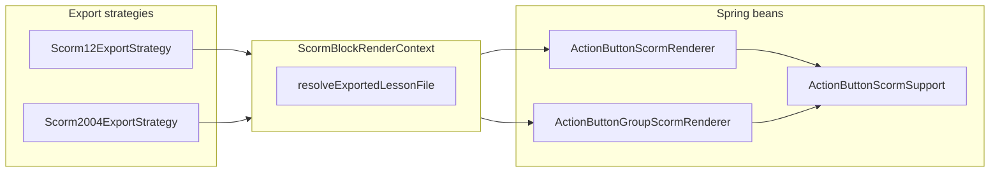

# Phase 4 — Action button SCORM export (development plan)

**Status:** Implemented in `course-forge-backend` (registry renderers, dual SCORM CSS, lesson navigation map, tests).

**Goal:** Export `ACTION_BUTTON` and `ACTION_BUTTON_GROUP` as static, LMS-friendly HTML that mirrors authoring intent from `course-forge-frontend`, with **SCORM 1.2** and **SCORM 2004** parity (same markup/CSS pattern in both template trees).

**Related docs:**

- `SCORM_EXPORT_PHASE4_DEVELOPMENT_PLAN.md` (Phase 4 umbrella; row **4.3** action buttons).
- `SCORM_EXPORT_REQUIREMENT_ANALYSIS.md` / `SCORM_EXPORT_SOLUTION_DESIGN.md` (export architecture, registry pattern).

---

## 1. Scope

### In scope

| Block type | Behavior |
|------------|----------|
| `ACTION_BUTTON` | Single card: optional supporting text + one primary CTA wired per `actionType`. |
| `ACTION_BUTTON_GROUP` | One card per row; payload from `buttons` with fallback to `items`; rows sorted by `orderIndex`. |

### Out of scope

- REST API or validation rule changes (`BlockContentValidator` remains source of truth).
- New global SCORM APIs beyond existing `window.scormManager` in packaged `scorm-manager.js`.
- SPA / React runtime in the package (export is static HTML + existing JS only).

---

## 2. Authoring UI vs stored `actionType`

Authoring dropdowns live in:

- `course-forge-frontend/src/features/editor/components/blocks/editor/interactive/ActionButtonEditor.tsx`
- `course-forge-frontend/src/features/editor/components/blocks/editor/interactive/ButtonStackEditor.tsx`

Preview behavior reference:

- `course-forge-frontend/src/features/editor/components/blocks/preview/blockRenderer.tsx` (`ACTION_BUTTON`, `ACTION_BUTTON_GROUP`).

| UI label | Stored `actionType` | SCORM export behavior |
|----------|---------------------|------------------------|
| External Webpage | `WEB_LINK` | `<a class="lesson-action-button-cta" href="...">`; `target="_blank"` and `rel="noopener noreferrer"` when URL scheme is `http`, `https`, or `ftp`. |
| Relative URL | `INTERNAL_LINK` | Same `<a>` styling; same-window navigation (no forced `target="_blank"`). |
| Email Address | `EMAIL` | `href` is `mailto:` + addresses. Normalize: strip one leading `mailto:` from stored `destination` if present, then build `mailto:` once (avoid `mailto:mailto:`). |
| Lesson Navigation | `NAVIGATE_LESSON` | `destination` is target lesson UUID. Resolve to exported filename `lesson_N.html` via export-time map (see section 4). If unknown, show visible fallback text (no silent broken link). |
| Exit Course (LMS Only) | `EXIT_COURSE` | `<button type="button">` with `onclick` calling `window.scormManager.terminate()` when present; HTML-escaped `&&` as `&amp;&amp;` in attribute. |

**Note:** Lesson templates may hide “Lesson Navigation” in the UI, but persisted content may still contain `NAVIGATE_LESSON`; the renderer must support it.

Backend validation reference:

- `course-forge-backend/src/main/java/com/mundrisoft/courseforge/service/BlockContentValidator.java` — `validateActionButtonContent`, `validateActionButtonGroupContent`.

---

## 3. Architecture

1. **Strategies** build an ordered map `lessonId → lesson_N.html` (same iteration order as lesson file generation: modules by course, lessons by module).
2. **`ScormBlockRenderContext`** carries `Function<String, String> resolveExportedLessonFile` so renderers stay free of services.
3. **`ScormBlockHtmlRendererRegistry`** picks `ActionButtonScormRenderer` / `ActionButtonGroupScormRenderer` by `BlockType` (no legacy `switch` cases required for these types).

---

## 4. Implementation map (code)

| Area | Location |
|------|----------|
| Context field | `course-forge-backend/.../export/render/ScormBlockRenderContext.java` |
| Lesson index map + wiring | `Scorm12ExportStrategy.java`, `Scorm2004ExportStrategy.java` — `buildLessonIdToExportedLessonFile`, passed into `generateLessonFromData` |
| Shared HTML | `export/render/blocks/ActionButtonScormSupport.java` |
| Single block | `export/render/blocks/ActionButtonScormRenderer.java` |
| Group block | `export/render/blocks/ActionButtonGroupScormRenderer.java` |
| Styles (dual tree) | `export-templates/scorm12/css/blocks.css`, `export-templates/scorm2004/css/blocks.css` — classes under `lesson-action-button-*` |
| Tests | `JourneyBlockRenderersTest.java` — per `actionType` assertions + group `orderIndex` |

### Product rules (SCORM-only)

- Use semantic **`<a href>`** / **`mailto:``** for link-like actions; style links as buttons via shared CSS (`a.lesson-action-button-cta`).
- **`EXIT_COURSE`** uses a real **`<button>`** (no `href`).
- **`NAVIGATE_LESSON`** must target **`lesson_N.html`** in the same relative layout as existing prev/next lesson links in the package.

---

## 5. CSS (dual parity)

Rules are duplicated in **both** `scorm12` and `scorm2004` `blocks.css` (Phase 4 parity rule).

Key classes:

- `lesson-action-button`, `lesson-action-button-group`, `lesson-action-button-group-empty`
- `lesson-action-button-card`, `lesson-action-button-inner`, `lesson-action-button-copy`, `lesson-action-button-actions`
- `lesson-action-button-cta`, `lesson-action-button-cta--exit`, `lesson-action-button-cta--unavailable`

---

## 6. Testing checklist

Automated (see `JourneyBlockRenderersTest`):

- [x] `WEB_LINK` — external URL, `target="_blank"`, `rel="noopener noreferrer"`.
- [x] `INTERNAL_LINK` — relative `href`, no `target="_blank"`.
- [x] `EMAIL` — `mailto:` href; destination already prefixed with `mailto:` does not double-prefix.
- [x] `NAVIGATE_LESSON` — resolver returns `lesson_2.html` for a known UUID stub.
- [x] `EXIT_COURSE` — `<button>` and `scormManager.terminate` in `onclick`.
- [x] `ACTION_BUTTON_GROUP` — two buttons with inverted `orderIndex`; `https://a.com` appears before `https://b.com` in output.

Manual (recommended):

- [ ] Full ZIP export: open lesson HTML in SCORM Cloud; click each action type (especially exit and cross-lesson link).
- [ ] Group with mixed `actionType`s per row.

---

## 7. Done criteria (this deliverable)

- [x] `ACTION_BUTTON` and `ACTION_BUTTON_GROUP` render via registry in both SCORM strategies (same dispatcher path).
- [x] All five `actionType` values have defined HTML behavior + tests for wiring.
- [x] Lesson UUID → `lesson_N.html` resolution matches export lesson ordering.
- [x] CSS present in **scorm12** and **scorm2004** template trees.

---

## 8. Follow-ups (optional)

- Additional fixtures: `ACTION_BUTTON_GROUP` using `items` only, or rows with `EXIT_COURSE` + `NAVIGATE_LESSON` mixed.
- Manual LMS matrix note in `SCORM_EXPORT_TICKETS.md` if your process requires it.
