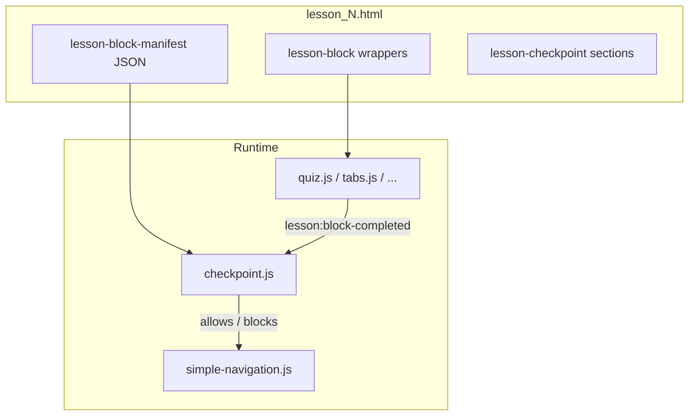

# Phase 4 — CHECKPOINT SCORM export (development plan)

**Status:** Implemented in `course-forge-backend` (renderer, dual `checkpoint.js`, lesson block manifest + wrappers, **strict boundary** — hide blocks after first unpassed checkpoint until Continue — navigation gate, trackable completion hooks, CSS, tests).

**Goal:** Export `CHECKPOINT` as static HTML plus a small LMS-safe runtime so behavior matches **course preview** and **API validation**, with **SCORM 1.2** and **SCORM 2004** parity (same markup, CSS, and JS contract in both template trees).

**Related docs:**

- `SCORM_EXPORT_PHASE4_DEVELOPMENT_PLAN.md` (umbrella; step **4.7**, section **6.5**).
- `SCORM_EXPORT_REQUIREMENT_ANALYSIS.md` / `SCORM_EXPORT_SOLUTION_DESIGN.md` (export architecture, registry pattern, completion contract).

**Authoritative product references:**

| Layer | Path |
|-------|------|
| Preview logic | `course-forge-frontend/src/lib/checkpointUtils.ts` (`normalizeCheckpointContent`, `mapCompletionTypeFromApi`, `isCheckpointButtonEnabled`, `TRACKABLE_BLOCK_TYPES`, `trackProgress`, storage keys) |
| Preview UI | `course-forge-frontend/src/features/editor/components/blocks/preview/blockRenderer.tsx` (`case "checkpoint"`) |
| Backend validation | `course-forge-backend/src/main/java/com/mundrisoft/courseforge/service/BlockContentValidator.java` — `validateCheckpointContent` (`buttonText`, `completionType` in `NONE` / `PREVIOUS` / `ALL`) |

**Export wiring reference:**

- `Scorm12ExportStrategy` / `Scorm2004ExportStrategy`: `generateLessonFromData`, `generateBlocksFromData`, `generateBlockHtml` → `scormBlockHtmlDispatcher.dispatch(...)`.
- Lesson navigation: `export-templates/scorm12/js/simple-navigation.js` (and 2004 twin) — `.btn-next` / `.btn-prev` call `navigateToLesson`; checkpoint must integrate without breaking existing flows.

---

## 1. Scope

### In scope

| Concern | Behavior |
|---------|----------|
| Content contract | `buttonText` (required per validator), `completionType` (`NONE` / `PREVIOUS` / `ALL`), optional `hintText`, optional `locked` (default gated), optional `trackProgress` (local persistence). |
| Button enablement | Same rules as `isCheckpointButtonEnabled` in `checkpointUtils.ts` (including edge cases: invalid `PREVIOUS` target → stay disabled with hint). |
| Continue action | Learner clicks continue when enabled; state updates so downstream gating / navigation can proceed. |
| Next-lesson gating | Until checkpoint requirements are satisfied (and continue acknowledged where applicable), **Next** must not advance the learner past policy (see Task 5). |
| Dual SCORM | Identical assets and behavior under `export-templates/scorm12/` and `export-templates/scorm2004/`. |

### Out of scope (unless product explicitly expands)

- Changing REST export API contracts.
- DB schema or breaking `Block` model changes.
- SCORM sequencing / `adlseq:navigation` XML beyond current package model (keep HTML/JS gating).
- Calling back to Course Forge from the SCORM package.

---

## 2. Phase 0 — Lock the contract (ticket / PR description)

Document next to preview source of truth:

- Mapping from API `completionType` strings to internal rule (already in TS; **mirror in SCORM JS**).
- Which block types count as **trackable** for gating (start from `TRACKABLE_BLOCK_TYPES` in `checkpointUtils.ts`; map to exported `BlockType` enum names, e.g. `QUIZ`, `FLASH_CARDS_STACK`, `TAB`).

**Acceptance**

- [ ] Written agreement on **trackable set** for SCORM v1 (full parity vs subset).
- [ ] Written agreement on whether **INTERACTIVE_IMAGE**, **SORT_AND_LEARN**, **DRAG_AND_DROP** count as trackable if not in frontend list (default: **off** unless preview counts them).
- [ ] **Deadlock / fail-safe:** when `PREVIOUS` / `ALL` references a non-trackable or missing neighbor, behavior matches preview (disabled + visible hint); optional “contact course author” copy.

---

## 3. Task-by-task checklist

### Task 1 — Lesson block manifest (order + ids + types)

**Problem:** `generateBlocksFromData` concatenates renderer HTML only. CHECKPOINT evaluation needs **export order** and **stable block UUIDs** for `PREVIOUS` / `ALL`.

**Implementation**

1. In `generateLessonFromData` in **both** `Scorm12ExportStrategy.java` and `Scorm2004ExportStrategy.java`, build a JSON array from `List<Block> blocks` before/after block HTML generation, e.g.:

   - `id`: `block.getId()`
   - `type`: `block.getType().name()` (or another stable string agreed with JS)

2. Inject into the lesson page via a new placeholder (e.g. `{{LESSON_BLOCK_MANIFEST}}`) or a `<script type="application/json" id="lesson-block-manifest">…</script>` adjacent to `{{LESSON_BLOCKS}}` in:

   - `course-forge-backend/src/main/resources/export-templates/scorm12/html/lesson-template.html`
   - `course-forge-backend/src/main/resources/export-templates/scorm2004/html/lesson-template.html`

3. Serialize with `ObjectMapper`; escape `<` as `\u003c` in embedded JSON (same pattern as elsewhere in export) to avoid premature `</script>` termination.

**Acceptance**

- [ ] Exported `lessons/lesson_N.html` contains a manifest whose **sequence** matches editor order.
- [ ] Every manifest entry uses server **block UUIDs**, not only sequential `blockNumber`.

---

### Task 2 — `CheckpointScormRenderer` (dispatcher)

**Files**

- New: `course-forge-backend/src/main/java/com/mundrisoft/courseforge/export/render/blocks/CheckpointScormRenderer.java`
- Register via existing Spring `List<ScormBlockHtmlRenderer>` / registry (same pattern as other Phase 4 renderers).

**Markup (recommended)**

- Outer: `section.lesson-checkpoint` with `data-block-id="{uuid}"` (and optional `data-lesson-id` from context).
- Hint region + primary button; button `data-checkpoint-button="1"`, label from resolved `buttonText` (fallback **Continue** per preview).
- Initial render: `disabled` + `aria-disabled="true"` when policy starts gated; `checkpoint.js` enables when rules pass.

**Acceptance**

- [ ] `CHECKPOINT` does not fall through to legacy “Unsupported block type”.
- [ ] Emitted HTML is safe (escape user strings; hint may be HTML vs plain per preview — match `blockRenderer.tsx`).

---

### Task 3 — Shared runtime `checkpoint.js` (both SCORM trees)

**Files**

- New: `course-forge-backend/src/main/resources/export-templates/scorm12/js/checkpoint.js`
- New: `course-forge-backend/src/main/resources/export-templates/scorm2004/js/checkpoint.js` (**keep identical**)
- Wire in lesson templates: `<script src="../js/checkpoint.js"></script>` (path consistent with siblings).
- **Strategy + manifest:** mirror `sort-and-learn.js` wiring in `Scorm12ExportStrategy` / `Scorm2004ExportStrategy` (copy to workspace + `<file href="...">` in package manifest).

**Runtime responsibilities**

1. Parse `#lesson-block-manifest` (or agreed id) once per page load.
2. Normalize checkpoint payload per block (mirror `normalizeCheckpointContent` / `mapCompletionTypeFromApi` / `getCheckpointButtonText`).
3. Maintain a `Set` of **completed trackable** block ids; listen for a single custom event, e.g. `lesson:block-completed` with `detail: { blockId }`.
4. Re-evaluate every checkpoint on the page when completions change; update button `disabled` / `aria-disabled` / classes to match preview.
5. If `trackProgress` is true, persist completions (and optionally checkpoint-passed flags) to `localStorage` using a key scheme aligned with `getLessonCheckpointStorageKey` in `checkpointUtils.ts`; restore on load.
6. On **Continue** click (when enabled): record checkpoint as passed; expose a small **namespaced** API (e.g. `window.lessonCheckpointGate`) for navigation (Task 5).

**Trackable type map**

- Single table in `checkpoint.js`: frontend trackable types → exported `BlockType` names used in manifest.

**Acceptance**

- [ ] `NONE`: button becomes enabled per rules immediately (unless `locked` semantics differ — match preview).
- [ ] `PREVIOUS`: completing only the immediate previous **trackable** block in manifest enables continue.
- [ ] `ALL`: partial completion keeps disabled; when all trackables above are complete, enabled.
- [ ] Reload with `trackProgress=true` restores state without breaking non-trackable blocks.

---

### Task 4 — Emit `lesson:block-completed` from interactives

**Files (extend incrementally; both scorm12 and scorm2004 copies)**

Examples:

- `export-templates/scorm12/js/quiz.js` (+ 2004)
- `export-templates/scorm12/js/flashcards.js` (+ 2004)
- `export-templates/scorm12/js/tabs.js` (+ 2004)
- Others as agreed trackable set (e.g. carousel if preview counts it)

**Pattern**

- After the learner action that counts as “complete” for gating, dispatch:

  `document.dispatchEvent(new CustomEvent('lesson:block-completed', { detail: { blockId: '...' } }));`

- Resolve `blockId` from a host element with `data-block-id` (see Task 4b).

**Acceptance**

- [ ] At least **QUIZ** + one other trackable emit the event on real completion (not on mere view).
- [ ] No duplicate spam on revisit unless idempotent handling in `checkpoint.js` (Set dedupes).

---

### Task 4b (recommended) — Per-block wrapper in `generateBlocksFromData`

**Files:** `Scorm12ExportStrategy.java`, `Scorm2004ExportStrategy.java` — `generateBlocksFromData`.

Wrap each rendered block:

```html
<div class="lesson-block" data-block-id="..." data-block-type="QUIZ">…renderer output…</div>
```

**Acceptance**

- [ ] Deep DOM in quiz/tabs does not require fragile `id` guessing.
- [ ] No REST/API contract change; HTML-only.

---

### Task 5 — Gate **Next lesson** (`simple-navigation.js`)

**Files**

- `export-templates/scorm12/js/simple-navigation.js`
- `export-templates/scorm2004/js/simple-navigation.js` (if not byte-identical, update both)

**Behavior**

- Before `navigateToLesson` for **Next**, consult `window.lessonCheckpointGate` (or equivalent) from `checkpoint.js`.
- If blocked: `preventDefault`, scroll first blocking checkpoint into view, optional `aria-live` feedback.

**Acceptance**

- [ ] Incomplete gating: Next does not leave the lesson against policy.
- [ ] All requirements satisfied: Next behaves exactly as today.
- [ ] No infinite loop or silent no-op without user-visible feedback.

---

### Task 6 — Styling (`blocks.css`, both trees)

**Files**

- `export-templates/scorm12/css/blocks.css`
- `export-templates/scorm2004/css/blocks.css`

Mirror preview structure (locked strip vs card, hint + footer button row). Include disabled/focus states for accessibility.

**Acceptance**

- [ ] Readable in a plain LMS without Tailwind.
- [ ] No CSS parse errors (brace-balanced; lessons learned from prior Phase 4 CSS fixes).

---

### Task 7 — Backend validation (optional hardening)

**File:** `BlockContentValidator.java` — `validateCheckpointContent`.

Non-breaking additions only:

- Optional bounds on `hintText` length.
- Optional `locked` / `trackProgress` booleans if not already implied.
- Reject unknown `completionType` values with clear messages.

**Acceptance**

- [ ] Invalid payloads fail at API with actionable errors.
- [ ] Existing valid payloads unchanged.

---

### Task 8 — Tests

**Files**

- `course-forge-backend/src/test/java/com/mundrisoft/courseforge/export/render/blocks/JourneyBlockRenderersTest.java` — checkpoint renderer smoke + key `data-*` attributes.
- Optional: focused test for manifest JSON generation (pure Java).

**Acceptance**

- [ ] At least one assertion per `completionType` shape on emitted HTML (or manifest fixture).
- [ ] CI green; dual-strategy parity spot-checked (12 + 2004).

---

## 4. Suggested implementation order

1. **Task 1** (manifest) + **Task 4b** (wrapper) — unblocks all runtime.
2. **Task 3** (`checkpoint.js`) — core state machine + persistence.
3. **Task 4** (completion events) — start minimal set, expand to full trackable list.
4. **Task 5** (navigation integration).
5. **Task 2** (`CheckpointScormRenderer`) in parallel once manifest contract is stable.
6. **Task 6** (CSS), **Task 7** (validator), **Task 8** (tests).

---

## 5. Architecture sketch



---

## 6. Definition of done (this feature)

- [ ] CHECKPOINT renders in **both** SCORM packages for valid payloads.
- [ ] Enablement rules match preview for agreed trackable set.
- [ ] Next-lesson navigation respects gating without deadlock on agreed degrade paths.
- [ ] Assets copied and listed in manifest; templates load `checkpoint.js`.
- [ ] Automated tests cover renderer and/or manifest; manual LMS smoke recorded.

---

## 7. Revision history

| Version | Date | Author / note |
|---------|------|----------------|
| 1.0 | 2026-05-05 | Initial checklist from Phase 4 planning. |
